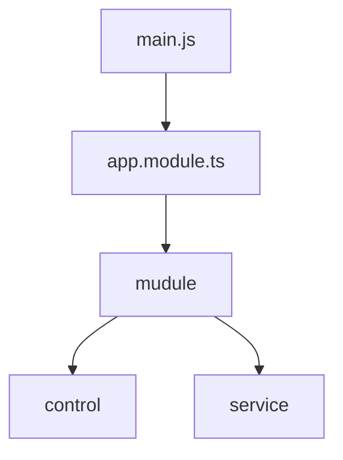
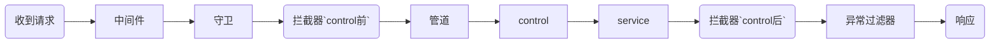

## 开始


## 基本结构



`nest --help查看命令`

---

## control

+ 响应客户端请求

  ```typescript
  import { Controller, Get, Post, Query } from '@nestjs/common';
  import { HelloService } from './hello.service';
  @Controller('/hello')//当访问'/hello'时响应
  export class HelloController {
      constructor(private readonly helloService: HelloService) {}//依赖注入
      @Get()
      gethello() { //get请求，调用servce方法
          return this.helloService.getHello()
      }
      @Get("article") //二级路由
      getarticle() {
          return ["messge","messge"]
      }
  }
  ```

+ get请求

  ```typescript
  //通过@Query装饰器获取get传值
  @Get()
  gethello(@Query() query) {
      console.log(query) //http://localhost:3000/hello?name=xiaoming&id=123
      return this.helloService.getHello()
  }
  ```

  ```typescript
  //可选参数
  @Get() http://localhost:3000/hello?id=123&name=wangcai
  gethello(@Query('id') id) { //只获取id
      console.log(id)
      return this.helloService.getHello()
  }
  ```

  ```typescript
  //通过@Request装饰器获取get传值
  gethello(@Request() req) {
      console.log(req.query)
      return this.helloService.getHello()
  }
  ```

+ post请求

  ```typescript
  //通过@Body装饰器获取post传值 
  @Post("creat") //http://localhost:3000/hello/creat
  post(@Body() body) {
      console.log(body) //postman的body中设置请求参数
      return "post请求"
  }
  ```

+ 其他请求

  ```typescript
  @Controller('animal')
  export class AnimalController {
      constructor(
      private readonly animalService: AnimalService,
       private readonly appService: AppService,
       private readonly birdService: BirdService,
       private readonly animalResolver: AnimalResolver,
      ) {}
      @Get('all')
      all() {
          return this.animalService.findAll();
      }
      @Get('find')
      findById(@Query() query) {
          console.log(query)
          return this.animalService.findById(query.id);
      }
      @Post('add')
      add(@Body() param): any {
          return this.animalService.add(param);
      }
      @Patch(':id') //更新,动态路由,获取123并赋值给id
      update(@Param() param,@Body() body) {
          return this.animalService.update(param.id,body);
      }
      @Delete('delete')
      delete(@Query() {id}){
          return this.animalService.delete(id)
      }
      @Get('redirct')
      @Redirect('https://nestjs.com', 301)
      Redirect() {
          return "重定向"
      }
  }
  ```

---

## service

+ 定义服务

  ```typescript
  //service.ts
  //nest g service news //命令创建服务
  import { Injectable } from '@nestjs/common';
  //服务就是@Injectable装饰的类
  @Injectable()
  export class NewsService {
      findAll(){
          return [
              '或许辨不清日升日落',
              '或许看不到流云晚霞',
          ];
      }
  }
  ```

+ 使用服务

  ```typescript
  import {Controller,Get,Query,} from '@nestjs/common';
  import { AppService } from './app.service';
  @Controller("app")
  export class AppController {
      constructor(
      private readonly appService: AppService
      ) {} //依赖注入
      @Get()
      getHello(@Query() query): string {
          return this.appService.service();
      }
  }
  ```

---

## module

+ 模块间相互调用方法

  + 方法1:`controller`所在模块中导入

    ```typescript
    //不同模块间调用service需要在controller所在Module中注入service，providers:由 Nest 注入器实例化的提供者，并且可以至少在整个模块中共享
    //animal.moduel.ts
    import { Module } from '@nestjs/common';
    import {BirdService}  from "../bird/bird.service"
    import { AnimalController } from './animal.controller';
    @Module({
      providers: [BirdService],//animal模块使用bird模块服务
      controllers: [AnimalController],
    })
    export class AnimalModule {}
    ```

  + 方法2：导入提供`service`的模块

    ```typescript
    //每个模块都是一个共享模块，一旦创建就能被任意模块重复使
    //bird.moduel.ts提供
    import { Module } from '@nestjs/common';
    import { BirdService } from './bird.service';
    @Module({
        providers: [BirdService],
        exports: [BirdService],//bird导出服务
    })
    export class BirdModule {}
    ```

    ```typescript
    //animal.moduel.ts使用
    import { Module } from '@nestjs/common';
    import { BirdModule } from '../bird/bird.module';
    import {join} from "path"
    @Module({
      imports: [BirdModule],//导入bird模块使用
      controllers: [AnimalController],
    })
    export class AnimalModule {}
    ```

  + 方法3：全局模块

    ```typescript
    import { Module,Global } from '@nestjs/common';
    import { BirdService } from './bird.service';
    @Global()
    //@Global 装饰器使模块成为全局作用域。 全局模块应该只注册一次，最好由根或核心模块注册。
    @Module({
      providers: [BirdService],
      exports: [BirdService],
    })
    export class BirdModule {}
    ```

---

## swagger

+ 初始化

  ```bash
  npm install --save @nestjs/swagger swagger-ui-express
  ```

  ```typescript
  import { NestExpressApplication } from '@nestjs/platform-express';
  async function bootstrap() {
      const app = await NestFactory.create<NestExpressApplication>(AppModule);
      const config = new DocumentBuilder()
      .setTitle('Cats example')
      .setDescription('The cats API description')
      .setVersion('1.0')
      .addTag('cats')
      .build();
      const document = SwaggerModule.createDocument(app, config);
      SwaggerModule.setup('api', app, document); //http://localhost:3000/api/
  
      await app.listen(3000);
  }
  bootstrap();
  ```

---

## 生命周期



`抛出异常则进入异常过滤器结束`

---

## [守卫](https://www.ddhigh.com/2019/08/27/nestjs-guard.html)

+ 路由守卫本质上也是中间件的一种，中间件的职责是不明确的，中间件可以干任何事（数据校验，格式转化，响应体压缩等等）。路由守卫只能返回true和false来决定放行/阻断当前请求，不可以修改request/response对象，职责单一。

+ 定义

  ```typescript
  import { Injectable, CanActivate, ExecutionContext } from '@nestjs/common';
  import { Observable } from 'rxjs';
  
  @Injectable()
  export class RolesGuard implements CanActivate {
    canActivate(
      context: ExecutionContext,
    ): boolean | Promise<boolean> | Observable<boolean> {
      const request = context.switchToHttp().getRequest();
      console.log(request.header('authorization')) //token
      return true;
    }
  }
  ```

+ 使用

  ```typescript
  //路由守卫级别有全局、控制器、方法级别
  import {RolesGuard}  from "../common/guards/roles.guard"
  export class CatController {
    @Post()
    @UseGuards(RolesGuard)
    allCat() {
    }
  }
  //全局app.useGlobalGuards(new RolesGuard());
  ```

+ 角色的权限验证

  ```typescript
  //定义装饰器roles.decorator.ts自定义元数据附加到路由处理程序
  import { SetMetadata } from '@nestjs/common';
  export const Roles = (...roles: string[]) => SetMetadata('roles', roles);//{role:['admin']}
  ```

  ```typescript
  //定义守卫roles.guard.ts
  import { Injectable, CanActivate, ExecutionContext } from '@nestjs/common';
  import { Observable } from 'rxjs';
  import { Reflector } from '@nestjs/core';
  
  @Injectable()
  export class RolesGuard implements CanActivate {
      constructor(private reflector: Reflector){}
      canActivate(
      context: ExecutionContext,
  
      ): boolean | Promise<boolean> | Observable<boolean> {
          const request = context.switchToHttp().getRequest();
          const roles = this.reflector.get<string[]>('roles', context.getHandler()); //get方法获取roles
          if (!roles) { // 未被装饰器装饰，直接放行
              return true;
          }
          //判断用户身份逻辑
          return true;
      }
  }
  ```

  ```typescript
  //使用
  @Post()
  @Roles('admin')
  @UseGuards(RolesGuard)
  create() {
      //验证通过操作
  }
  ```

---


## 管道

## 装饰器

---

## [中间件](https://zhuanlan.zhihu.com/p/124292609)

+ 路由处理程序**之前**调用的函数。

+ 生产中间件

  ```typescript
  //common/middleware/logger.middlemare.ts
  import { Injectable, NestMiddleware } from '@nestjs/common';
  import { Request, Response, NextFunction } from 'express'; //底层express
  @Injectable()
  export class LoggerMiddleware implements NestMiddleware { //继承NestMiddlewares实现use方法
      use(req: Request, res: Response, next: NextFunction) {
          const {path,method}  = req
          console.log(path,method); //`/`,`GET`
          console.log(`Request Time:${Date()}`)
          next();
      }
  }
  ```

+ 消费中间件

  ```typescript
  //全局使用app.module.ts
  import { Module, NestModule, MiddlewareConsumer } from '@nestjs/common';
  import { LoggerMiddleware } from './common/middleware/logger.middleware';
  export class AppModule implements NestModule {
      configure(consumer: MiddlewareConsumer) {  //消费中间件
          consumer.apply(LoggerMiddleware).forRoutes('cat').exclude(
          { path: 'user/oauth', method: RequestMethod.GET },
          { path: 'user/login', method: RequestMethod.POST },
          { path: 'favicon.ico', method: RequestMethod.GET },
        )//路由使用，CatsController模块使用
      }
  }
  ```

---

## 拦截器

+ 定义:在函数执行之前/之后绑定额外的逻辑,转换从函数返回的结果

  ```typescript
  //定义拦截器refresh-token.interceptors.ts
  import { map } from 'rxjs/operators';
  import { Observable } from 'rxjs';
  @Injectable()
  export class RefreshToken implements NestInterceptor {
    constructor(private readonly catService: CatService) {}
    async intercept(context: ExecutionContext,next: CallHandler,): Promise<Observable<any>> {//每个拦截器都有 intercept() 方法,接收ExecutionContext(执行上下文)和CallHandler(调用处理程序)
      const { access_token } = await this.catService.sign({
        username: 'admin',
        password: '123',
      });
      console.log(access_token);
      return next.handle().pipe( //CallHandler要调用handle()方法才会触发，返回Observable
        map((data) => {  //data为返回数据
          if (!data.access_token) return { data, access_token };
          else return data;
        }),
      );
    }
  }
  ```

+ 绑定

  ```typescript
  //1.全局绑定
  //app.moudle.ts
  import { APP_INTERCEPTOR } from '@nestjs/core';
  import {RefreshToken}  from "./common/interceptors/refresh-token.interceptor"
  @Module({
      providers: [
          {
              provide: APP_INTERCEPTOR,
              useClass: RefreshToken,
          },
      ],
  })
  //2.方法、控制器层
  @UseInterceptors(LoggingInterceptor)
  ```

---

## 异常过滤器

+ 内置的**异常层**负责处理整个应用程序中的所有抛出的异常。当捕获到未处理的异常时，最终用户将收到友好的响应。

+ 定义异常

  ```typescript
  import {
    ExceptionFilter,
    Catch,
    ArgumentsHost,
    HttpException,
  } from '@nestjs/common';
  import { Request, Response } from 'express';
  
  @Catch(HttpException)
  export class HttpExceptionFilter implements ExceptionFilter {
    catch(exception: HttpException, host: ArgumentsHost) {
      const ctx = host.switchToHttp();
      const response = ctx.getResponse<Response>();
      const request = ctx.getRequest<Request>();
      const status = exception.getStatus();
      const res: any = exception.getResponse(); //传的参数
      const { error, msg } = res;
      response.status(status).json({
        statusCode: status,
        timestamp: new Date().toISOString(),
        path: request.url,
        error,
        msg
      });
    }
  }
  ```

+ 使用

  ```typescript
  //路由中使用(控制器级别与方法级别)
  import { Controller, Get, Param, UseFilters,Post,Body,HttpException,HttpStatus } from '@nestjs/common';
  import { HttpExceptionFilter } from '../common/filter/http-exception.filter';
  @Controller('cat')
  @UseFilters(HttpExceptionFilter)
  export class CatController {
    @Post()
    allCat(@Body() {id} ) {
      if (!id) throw new HttpException({error:"id is required",msg:"id必传"}, HttpStatus.FORBIDDEN);
       return 'cat';
    }
  }
  //全局main.ts中app.useGlobalFilters(new HttpExceptionFilter());
  ```
  
+ [Nestjs Flub](https://github.com/nestjsx/nestjs-flub/blob/master/README.md)

+ graphql异常

  https://www.cnblogs.com/coderxiaohei/p/14256248.html

---

## 安全

### local策略

+ 定义

  ```typescript
  //npm install --save @nestjs/passport passport passport-local
  //npm install --save-dev @types/passport-local
  //local.strategy.ts
  import { Strategy } from 'passport-local';
  import { PassportStrategy } from '@nestjs/passport';
  import { Injectable, UnauthorizedException } from '@nestjs/common';
  import { CatService } from './cat.service';
  @Injectable()
  export class LocalStrategy extends PassportStrategy(Strategy,'local') {//localStrategy本地策略，默认名local
    constructor(private readonly catService: CatService) {
      super(); 
    }
    async validate(username: string, password: string): Promise<any> {
      //守卫将自动调用validate，从body中获取username,password
     //throw不打印,"message": "Unauthorized"
      const user = await this.catService.validateUser(username, password);
      if (!user) {
        throw new UnauthorizedException( '用户名或密码错误');//没传用户名或密码抛出其他错误
      }
      return true;
    }
  }
  ```

+ 使用

  ```typescript
  @UseGuards(AuthGuard('local')) //使用策略
  @Post('login')
  async login(@Body() body) {
      return await this.catService.login(body); //返回token
  }
  ```

---

### [JWT策略](https://jwt.io/introduction)

```sequence
title: Json web token
浏览器-->服务器:提交用户名密码
Note right of 服务器:验证通过后，加密得到token(令牌)
服务器-->浏览器:将token响应给浏览器
Note left of 浏览器:请求头带上token
浏览器-->服务器:再次请求
Note right of 服务器:通过token还原出用户信息
服务器-->浏览器:再次响应
```

+ 返回token

  ```typescript
  import { Injectable } from '@nestjs/common';
  import { JwtService } from '@nestjs/jwt';
  var passport = require('passport')
  @Injectable()
  export class UserService {
      constructor(private readonly jwtService: JwtService) {}
      async validateUser(username: string, password: string): Promise<any> {
          if (username === 'admin' && password === '123') return username;
          else return null;
      }
      async login(code: string, res: Response) {
          const token = this.jwtService.sign(body);
          //response对象在graphql上下文中
          //@Context() context:any
          //const res = context.req.res
          res.cookie("Authorization", access_token, { httpOnly: true, maxAge: 1000 * 60 * 60 * 24 * 7 })//种植cookie
          return { access_token: token }; //验证通过返回token
      }
  }
  ```

+ 初始化

  ```typescript
  //npm install @nestjs/jwt passport-jwt
  //npm install @types/passport-jwt --save-dev
  // auth.module.ts
  import { Module } from '@nestjs/common';
  import { PassportModule } from '@nestjs/passport';
  import { LocalStrategy } from './local.strategy';
  import { JwtModule } from '@nestjs/jwt';
  import { jwtConstants } from './constants';//签名时使用秘钥
  import { JwtStrategy } from './jwt';
  @Module({
      imports: [
          PassportModule.register({defaultStrategy:"jwt"}),//默认jwt策略
          JwtModule.register({
              secret: jwtConstants.secret,
              signOptions: { expiresIn: '60s',issuer:"portal" },//issuer颁发者标识
          }),
      ],
      providers: [LocalStrategy,JwtStrategy],
  })
  export class CatModule {}
  ```
  
  ```typescript
  //定义jwt策略
  import { ExtractJwt, Strategy } from 'passport-jwt';
  import { PassportStrategy } from '@nestjs/passport';
  import { Injectable } from '@nestjs/common';
  import { jwtConstants } from './constants';//解密时使用秘钥
  
  @Injectable() //解析token
  export class JwtStrategy extends PassportStrategy(Strategy,'jwt') { //默认名jwt
      constructor() {
          super({
              //jwtFromRequest: ExtractJwt.fromAuthHeaderAsBearerToken(), //header获取Bearer token值
              jwtFromRequest: ExtractJwt.fromExtractors([(request: Request) => {
                  const token= request?.cookies["Authorization"]
                  if(token) return token  
                  return null
              }]),//从cookie中获取token
              ignoreExpiration: false,
              secretOrKey: jwtConstants.secret,
              issuer:"portal"//可以不验证
          });
      }
      async validate(payload: any) {
          //payload：jwt-passport认证jwt通过后解码的结果
          return { userId: payload.password, username: payload.username };
      }
  }
  ```
+ 使用策略

  ```typescript
  import { AuthGuard } from '@nestjs/passport';
  @UseGuards(AuthGuard())//方法、控制器
  @Get('list')
  list() {
      return ['大天狗', '玉藻前', '桃花妖'];
  }
  ```

+ GraphQL

  ```typescript
  //上下文
  import { GqlExecutionContext } from '@nestjs/graphql';
  const ctx = GqlExecutionContext.create(context);
  const GqlRequest = ctx.getContext().req;
  //jwt.guard.ts
  getRequest(context: ExecutionContext) {//覆盖方法使jwtguard能获取请求头token
      const ctx = GqlExecutionContext.create(context);
      return ctx.getContext().req;
  }
  //GqlExecutionContext 为每个参数公开相应的函数，比如 getArgs()，getContext()等等
  const path = ctx.getInfo().fieldName; //解析body
  ```

+ [passportjs](http://www.passportjs.org/)

+ [如何优雅的处理JWT过期问题](https://www.jianshu.com/p/5334589a2bbe)

---

### [GitHub OAuth](http://www.ruanyifeng.com/blog/2019/04/github-oauth.html)

```typescript
//1.前端请求https://github.com/login/oauth/authorize?client_id=e67af17239b756793555，用户确定后重定向到后端路由
//2.重定向http://localhost:3000/cat/oauth?code=27033ac7b31e95ff7a9f
//3.响应http://localhost:3000/cat/oauth请求
import { HttpService } from '@nestjs/axios';
async oauth(code) {
    const id = 'e67af17239b756793555',
          secret = 'b7575c664236f0978779072ae6c8bd5029c16bba';
    const url = `https://github.com/login/oauth/access_token?client_id=${id}&client_secret=${secret}&code=${code}`;
    const { data } = await this.httpService.get(url).toPromise();//通过code获取token
    if (data) {
        const access_token = data.split('=')[1].slice(0, -6); //&scope
        const res = await this.httpService  //通过token获取用户数据
        .get('https://api.github.com/user', {
            headers: { Authorization: `token ${access_token}` },
        })
        .toPromise();
        return res.data;
    } else {
        return 'github过期';
    }
}
```

---

### cookie

```typescript
//初始化
import cookieParser from 'cookie-parser';
app.use(cookieParser());
//cookie不支持跨域
GraphQLModule.forRoot({
    cors: {
        credentials: true,
        origin: true
    },
})
//vue apollo配置
link: createUploadLink({
    uri: 'http://localhost:3000/graphql',
    credentials: 'include',//请求带上cookie
}),
//playground配置
"request.credentials": "include",
//apollo sandbox配置
打开Include cookies
```

##  [GraphQL](http://graphql.js.cool/)

+ ### 安装依赖

>`npm i --save @nestjs/graphql graphql-tools graphql `
>
>`npm i apollo-server-express`// apollo-server-express@^3对应@nestjs/graphql@^9
>
>npm view apollo-server-express version//查看远程
>
>npm ls apollo-server-express//查看本地
>
>`NestJs`提供的`@nestjs/graphql`只是对 [Apollo server](https://link.juejin.cn/?target=https%3A%2F%2Fwww.apollographql.com%2Fdocs%2Fapollo-server%2F) 的包装

+ ### 初始化

  ```typescript
  //app.module.ts
  //https://tkssharma.com/nestjs-with-graphql-api-development/
  import { AuthorModule } from './author/author.module';
  import { Module } from '@nestjs/common';
  import { GraphQLModule } from '@nestjs/graphql';
  import { AuthorModule } from './author/author.module';
  @Module({
      imports: [
          AuthorModule,
          GraphQLModule.forRoot({
              //autoSchemaFile: true, //内存中生成
              debug: false,
              autoSchemaFile: join(process.cwd(), 'src/schema.gql'),//自动生成schema.gql文件,自动整合,Resolver中没用到不生成
              path:"/graphql",  //GraphQL服务器端口
              playground:true,//是否开启playground,或使用对象配置playground
              cors: true,
              installSubscriptionHandlers: false,//开启订阅服务
              include: [AuthorModule],//默认情况下，`GraphQL`在整个应用程序中搜索解析器,使用include限制模块的子集
          }),
      ],
  })
  export class AppModule {}
  ```

+ Model中定义 Schema 

  ```typescript
  //通过Model定义生成schema
    import { Field, Int, ObjectType } from '@nestjs/graphql';
    @ObjectType()
    export class Author {
      @Field(type => Int)
      id: number;
    
      @Field({ nullable: true })
      firstName: string;
    
      @Field({ nullable: true })
      lastName: string;
    }  
  ```

  type定义数据类型，标量类型是原始数据类型，只能存储单个值，包括：Int(32位整数),Float(有符号双精度浮点值),String(UTF - 8字符串)，Boolean(True或false),ID(唯一标识符),还有对象类型，允许嵌套类型。

+ cli plugin

  ```typescript
  //Model中1.{ nullable: true }可用?代替
  //2.@Field()中无配置(如description,type)可以不写@Field()
  ```

+ resolver:解析函数提供数据

  1. query查询:获取数据

     ```typescript
     //解析器，类似于controller,接口请求时响应数据
     //nest g resolver author
     import { Resolver, Query, Args, Int } from '@nestjs/graphql';
     import { Author } from './author.model';
     import { AuthorService } from './author.service';
     @Resolver()
     export class AuthorResolver {
       constructor(private readonly authorService: AuthorService) {}
       @Query((returns) => [Author])//使用的Schema
       author() { //根据方法名访问数据
         return this.authorService.findAll();//返回值需要符合[Author]格式
       }
     }
     ```

     ```typescript
     //ArgsType查询输入
     @ArgsType()
     export class query{
         @Field()
         name: string;
         @Field()
         id: string;
     }
     //使用
     @Query((returns) => User)
     async user(@Args() query: query) {}
     //playground
     query{
       user(name:"xx",id:"xx")
     }
     ```

  2. mutation：对数据进行变更

     [Repository API](https://typeorm.biunav.com/zh/repository-api.html#repositoryapi)

     ```typescript
     //输入对象看上去和常规对象一模一样，除了关键字是 input 而不是 type
     //1.定义Mutation
     @Mutation(returns => Author)  //返回查询字段
     async creatAuthor(@Args('newAuthor') newAuthor:inputAuthor) {//@Args('newAuthor')中为输入名
         return await this.authorService.creat(newAuthor);
     }
     //2.输入schema类型
     //eg:@ArgsType代表查询格式，@InputType代表输入格式
     @InputType()  //输入类型
     export class inputAuthor {
         @Field()
         firstName: string;
         @Field()
         lastName: string;
         @Field()
         name: string;
     }
     /*生成的schema
     type Mutation {
       creatAuthor(newAuthor: inputAuthor!): Author!
     }
     
     input inputAuthor {
       firstName: String!
       lastName: String!
       name: String!
     }
     */
     //3.serive
     async creat(author) {
         const newAuthor = this.authorRepository.create(author); //创建实例，只复制实体中存在属性
         //  this.authorRepository.insert(newAuthor); //插入返回空
         return this.authorRepository.save(newAuthor);
     }
     ```

     ```typescript
     //请求
     mutation mutationName{
         creatAuthor(newAuthor:{firstName:"七月的海",lastName:"七月的海",name:"七月的海"}){
             id
             firstName
             lastName
         }
      }
     ```

     ```typescript
     //DTO
     //它使用了功能强大的class-validator包及其声明性验证装饰器
     import { InputType, Field } from '@nestjs/graphql';
     import { IsNotEmpty, MinLength } from 'class-validator';
     
     @InputType()
     export class RegisterDto {
       @Field()
       @MinLength(3, { message: '最小长度为3' })
       @IsNotEmpty({ message: '用户名不能为空' })
       username: string;
     
       @Field()
       @IsNotEmpty({ message: '密码不能为空' })
       password: string;
     }
     ```

  3. subscription订阅：当数据发生更改，进行消息推送

     ```typescript
     /*1.启用订阅
     GraphQLModule.forRoot({
         installSubscriptionHandlers: true,
     })*/
     //2.定义订阅author.resolver.ts
     import {PubSub}  from "graphql-subscriptions"
     const pubSub = new PubSub();
     @Resolver((of) => Author){
         @Mutation((returns) => Api) //更新
         async update() {
             pubSub.publish('update', {commentUpdate:"change"  });//发布事件
         }
     }
     @Subscription(returns => String,{name: 'commentUpdate'})
     commentUpdate() {
         return pubSub.asyncIterator('update'); //asyncIterator订阅事件
     }
     }
     /*生成schema
     type Subscription {
       commentUpdate: String!
     }*/
     //3.请求
     subscription{
       commentUpdate
     }
     /*
     {
       "data": {
         "commentUpdate": "change"
       }
     }
     */
     ```

+ 发送请求

  ```typescript
  //http://localhost:3000/graphql
  query queryName{   
      //请求描述operationName,GraphQLModule中配置 context:({req})=>{ console.log(req.body.operationName)}获取
      author{
          userid:id //重命名id
          firstName
      }
  }
  //Apollo Server supports only GET/POST requests.
  ```

+ 查询片段

  ```typescript
  {
      author{
          lastName
              ...infomation
      }
  }
  fragment infomation  on Author{ //查询碎片
      id
      name
      firstName
  }
  ```

+ 查询变量

  ```typescript
  query  queryName($id:Float!,$last:Boolean!){
      __typename //查询类型
      oneAuthor(id:$id){
          __typename 
          id
          firstName
          lastName @include(if:$last)  //条件查询
      }
  }
  /*
  QUERY VARIBLES
  {
    "id": 6,
    "last":true
  }
  */
  ```

+ 传参

  ```typescript
  import { Resolver, Query, Args, Int } from '@nestjs/graphql';
  import { Author } from './author.model';
  import { AuthorService } from './author.service';
  @Resolver()
  export class AuthorResolver {
      constructor(private readonly authorService: AuthorService) {}
      @Query((returns) => [Author],{name:"writer"})//不写name默认author
      async oneAuthor(@Args({ name: 'id', type: () => Int }) id: number) {
          //或者@Args('id', { type: () => ID })/@Args('id')
          console.log(id)
          return await this.authorService.findOneById(id);
      }
  }
  ```

  ```typescript
  //前端请求
  {
      author1: oneAuthor(id:1){ //重命名
          userid:id
          name
      }
  }
  /*{
       "data": {
         "author1": {
           "userid": "1",
           "name": "三月的风"
         }
       }
  }*/
  ```

+ 校验参数类型

  ```typescript
  //定义校验类
  import {Min,Max,IsInt} from "class-validator"
  @ArgsType()
  class AuthorArgs { //DTO（数据传输对象）,对入参数据校验
    @Field(type => Int)
    @Max(1)
    id: number; //请求时参数名
  }
  ```

  ```typescript
  // 使用AuthorArgs 类
  @Args() id: AuthorArgs  //请求的参数名
  ```

+ 参数装饰器

  | Nest                      | Apollo                     | dec                                                          |
  | ------------------------- | -------------------------- | ------------------------------------------------------------ |
  | `@Root()`/`@Parent()`     | `root`/`parent`            | 这是该字段**父级**的解析器的返回值（父字段的解析器总是*在*该字段的子字段的解析器*之前*执行,query没有父级解析器）。 |
  | `@Context(param?:string)` | `context`/`context[param]` | 提供给所有解析器的上下文信息                                 |
  | `@Info(param?:string)`    | `info`/`info[param]`       | 这包含有关操作执行状态的信息（仅在高级情况下使用）。         |
  | `@Args(param?:string)`    | `args`/`args[param]`       | 此对象包含查询中传入的所有参数                               |

+ [解析器链](https://www.apollographql.com/docs/apollo-server/data/resolvers/#resolver-chains)

  ```typescript
  @Resolver((of) => Author) //父级解析器
  export class AuthorResolver {
      @ResolveProperty("ID",type=>String)  //字段解析器添加字段,String类型,更新schema.gql文件
      async authorDashID(@Parent() parent:Author) {  //默认字段名
          // console.log(parent)  //Author的查询值
          return `${parent.name}--${parent.id}`
    }}
  ```

---

## 缓存

+ 单个请求取消缓存

  ```typescript
  const data = await this.$apollo.query({
      query: gql`
        query user {
          user(id: 1) {
            id
            name
            gender
          }
        }`,
      fetchPolicy: "no-cache",//取消走缓存
      variables: {
          id: userid,
      },
  ```

+ 所有请求取消缓存

  ```typescript
  const apolloClient = new ApolloClient({
      link: createUploadLink({
          uri: 'http://localhost:3000/graphql',
          credentials: 'include',
      }),
      cache: new InMemoryCache(),
      connectToDevTools: true,
      defaultOptions: {
          query: {
              fetchPolicy: 'network-only'//取消缓存
          }
      }
  })
  ```

---

## 文件上传

+ restful文件上传

  ```typescript
  //Controller
  @Controller('upload')
  export class UploadController {
      constructor(private readonly uploadService: UploadService) { }
      //单文件上传
      @Post('img')
      @UseInterceptors(FileInterceptor("img"))
      async uploadImg(@UploadedFile() img: Express.Multer.File) {
          return { path: img.path.replace("public\\", "") }
      }
      //文件数组上传
      @Post('imgs')
      @UseInterceptors(FilesInterceptor("imgs", 5)) //多传Unexpected field
      async uploadImgs(@UploadedFiles() imgs: [Express.Multer.File]) {
          const paths = []
          imgs.forEach(i => {
              paths.push(i.path.replace("public\\", ""))
          });
          return { paths }
      }
      //多文件上传
      @Post('mulImg')
      @UseInterceptors(FilesInterceptor("img"))  //FileFieldsInterceptor自定义不同的字段名称键，AnyFilesInterceptor使用任意的字段名称
      async uploadMulImg(@UploadedFiles() mulImg: [Express.Multer.File]) {
          console.log(mulImg)
          const paths = []
          mulImg.forEach(i => {
              paths.push(i.path.replace("public\\", ""))
          });
          return { paths }
      }
  ```

  ```typescript
  //upload.Module.ts控制文件大小、类型，上传位置
  @Module({
    imports: [
      MulterModule.register({
        // dest: './public/img/',
        fileFilter(req, { mimetype, size, path }, cb) {
          if (mimetype.indexOf("image") === -1) {
            const error = new HttpException('上传图片类型错误', HttpStatus.UNSUPPORTED_MEDIA_TYPE);
            cb(error, false)
          }
          cb(null, true)
        },
        limits: { fileSize: 1024 * 1024 * 2 },
        storage: diskStorage({
          //自定义路径
          destination: async (req, file, cb) => {
            const { user } = req.headers
            const path = `public/userImg/${user}/`
            fs.exists(path, function (exists) {
              if (!exists) fs.mkdir(path, err => {
                if (err) throw new HttpException("创建文件夹失败", HttpStatus.INTERNAL_SERVER_ERROR)
              })
            })
            cb(null, path)
          },
          filename: (req, file, cb) => {
            return cb(null, file.originalname);
          }
        })
      })
    ],
  })
  ```

+ graphql文件上传

  ```typescript
  //使用graphql-upload实现文件上传
  //方法1.Apollo Server 2.0内置graphql-upload，GraphQLUpload, FileUpload从apollo -server-express导入
  //方法2.Apollo Server 3.0移除graphql-upload，使用3.0要使用graphqlUploadExpress中间件
  //https://www.apollographql.com/docs/apollo-server/data/file-uploads/
  import { GraphQLUpload, FileUpload } from 'graphql-upload';
  import { UploadService } from "./upload.service"
  import { UploadImgResult } from "./models/upload.model"
  
  @Resolver()
  export class UploadResolver {
      constructor(private readonly uploadService: UploadService) { }
      @Mutation((returns) => UploadImgResult)
      async uploadImg(@Args({ name: 'file', type: () => GraphQLUpload }) file: FileUpload, @Context() context) {
          return await this.uploadService.uploadImg(file, context)
      }
  }
  ```

  ```typescript
  //mian.ts使用graphqlUploadExpress中间件
  import { graphqlUploadExpress } from "graphql-upload"
  async function bootstrap() {
    const app = await NestFactory.create<NestExpressApplication>(AppModule, {
    app.useStaticAssets('public');
    app.use(graphqlUploadExpress());//可配置maxFileSize, maxFiles
    await app.listen(3000);
  }
  bootstrap();
  ```

  前端请求格式：https://github.com/jaydenseric/graphql-multipart-request-spec

  参考：

  + [Uploading files with NestJS and GraphQL](https://vortac.io/2020/05/09/uploading-files-with-nestjs-and-graphql/)
  
+ [NestJS file upload with GraphQL](https://dilushadasanayaka.medium.com/nestjs-file-upload-with-grapql-18289b9e32a2)

---

## 文件下载

+ express sendFile

  ```ts
  import { Controller, Get, Res } from '@nestjs/common';
  import { Response } from 'express'
  import path from 'path'
  @Controller('down')
  export class DownController {
    @Get()
    findAll(@Res() res: Response): string {
      //res.sendFile(path.join(__dirname,'../src/schema.gql'))
      res.download(path.join(__dirname,'../src/schema.gql'),'schema.gql')//设置文件名
      return '下载成功';
    }
  }
  ```

+ 文件流

  ```ts
  import { Controller, Get, StreamableFile } from '@nestjs/common';
  import { createReadStream } from 'fs';
  import path from 'path'
  @Controller('file')
  export class FileController {
      @Get()
      getFile(): StreamableFile {
          const file = createReadStream(path.join(process.cwd(), 'package.json'));//创建文件流
          res.set({//自定义响应
              'Content-Type': 'application/json',
              'Content-Disposition': 'attachment; filename="package.json'//设置文件名
          })
          return new StreamableFile(file);
      }
  }
  ```

---

## 文件压缩

+ tar

  ```ts
  import { tar } from 'compressing'
  import path from 'path'
  tar.compressDir(path.join(__dirname,'../dist'), './dist.tar')
      .then(()=>{
      console.log('压缩成功');
  })
      .catch(e=>{console.log(e);
                });
  ```

+ 压缩文件流

  ```ts
  import { Controller, Get, Res, StreamableFile } from '@nestjs/common';
  import { Response } from 'express'
  import { tar } from 'compressing'//包括tar、gzip、tgz、zip。zipGzip仅支持压缩单个文件
  import path from 'path'
  @Controller('files')
  export class FileController {
      @Get()
      getFile(@Res() res: Response) {
          const tarStream = new tar.Stream();
          tarStream.addEntry(path.join(__dirname, '../dist'))//压缩文件
          res.set({
              'Content-Type': 'application/oct-stream',//流形式
              'Content-Disposition': 'attachment; filename=dist.tar'
          })
          return tarStream.pipe(res);
      }
  }
  ```

+ 解压

  ```ts
  const data=path.join(process.cwd(), `/public/dist.tar`)
  const file = path.join(process.cwd(), `/public`)//文件名默认原来文件名
  tar
      .uncompress(data, file)
      .then(() => console.log("uncompress done"))
      .catch(console.error);
  ```

---

## 文件转换

+ libreoffice-convert

  <!-- <blockquote style="border-left: 4px solid #42b983;">
      <p>1.需要安装安装 libreoffice
      <p>2.window:index.js
      <p> //let command = `-env:UserInstallation=file://${installDir.name} --headless --convert-to ${format}`;
      <p> let command = `${installDir.name} --headless --convert-to ${format}`; -->

  ```typescript
  import libre from 'libreoffice-convert';
  import * as fs from 'fs';
  import path from 'path';
  const { promisify } = require('bluebird');
  let libreConvert = promisify(libre.convert)
  
  const extend = '.pdf'//转换的格式
  const enterPath = path.join(__dirname, '../public/');//读取文件路径
  const outputPath = path.join(__dirname, '../preview/');//输出文件路径
  fs.readdir("./public/", async (err, data) => {
    if (err) console.log(err)
    for (let i of data) {
      if (i.indexOf('.') !== -1) {
        const file = fs.readFileSync(enterPath + i);
        let done = await libreConvert(file, extend, undefined)//转换为pdf的format为undefined
        fs.writeFileSync(outputPath + i + extend, done);//输出转换后的文件
      }
    }
  })
  ```
  
+ sheet.js

  ```typescript
  const XLSX = require('XLSX')
  const workbook = XLSX.readFile('./public/10-26.xlsx')//文件对象
  var worksheet = workbook.Sheets[workbook.SheetNames[0]];
  const str = XLSX.utils.sheet_to_html(worksheet, {editable: true,id:"11"})//html字符串,editable可编辑
  fs.writeFile('./output/excel.csv', str, (err) => {
      if (err) console.log(err)
     else console.log('写入成功')
  })
  ```

  ```typescript
  //or
  const XLSX = require('XLSX')
  const workbook = XLSX.readFile('./public/10-26.xlsx')//文件对象
  XLSX.writeFile(workbook, './output/10-26.html',  { bookType: "html" ,editable: true});
  ```
  

---

## 截屏

+ `puppeteer`

  ```typescript
  //https://www.lxchuan12.cn/puppeteer-create-pdf-and-merge
  const puppeteer = require('puppeteer');
  (async () => {
      //const browser = await puppeteer.launch({ executablePath: 'C:/Program Files (x86)/ChromeCore/ChromeCore.exe',headless: false})//使用自定义浏览器
      const browser = await puppeteer.launch({
          // headless: false,//是否查看浏览器界面,false打开,pdf不支持
          // devtools:true//f12
      });//启动浏览器
      const page = await browser.newPage();//浏览器打开页面
      await page.goto('https://example.com',{ waitUntil: 'networkidle2' });//页面加载url
      // await page.screenshot({ path: './output/example.png' });//截屏生成png
      await page.pdf({ path: './output/example.pdf', format: 'a4' });//页面保存为pdf
      await browser.close();
      console.log("完成")
  })();
  ```
  
+ pdf合并

  ```js
  //依赖pdftk(https://www.pdflabs.com/docs/pdftk-man-page/)
  //或者使用网站https://smallpdf.com
  const PDFMerge = require('pdf-merge');
  const fs = require('fs');
  const { join } = require('path');
  const files = fs.readdirSync('./pdfs')
  async function merge(name) {
      for (let i = 0; i < files.length; i++) {
          files[i] = join(__dirname, `/pdfs/${files[i]}`)
      }
      await PDFMerge(files, { output: `${__dirname}/pdfs/${name}.pdf` })
      for (let i = 0; i < files.length; i++) {//删除
          fs.unlinkSync(files[i])
      }
  }
  merge('new')
  ```

---

## HTTP模块

```typescript
//cat模块导入http模块
import { HttpModule } from '@nestjs/axios';
@Module({
    imports:[HttpModule.register({})]
})
//catService使用httpserive
import { HttpService } from '@nestjs/axios';
@Injectable()
export class CatService {
    constructor(private readonly httpService: HttpService,){}
    async oauth (){
        const url = "www.baidu.com"
        //返回的类型为Observables
        const { data } = await this.httpService.get(url).toPromise();
    }
}
```

+ 处理Observables对象

  ```typescript
  //1.转换为promise
  this.httpService.get(url).toPromise();
  //2.订阅subscribe
  login() {
      return new Promise(resolve => {
          this.httpService
          .get(url)
          .subscribe((res) => resolve(res));
      });
  }
  
  this.httpService
      .get(url)
      .subscribe((res) => console.log(res));
  //3.map
  import { AxiosResponse } from 'axios';
  import { map } from 'rxjs/operators';
  this.httpService
      .get(url)
      .pipe(
      map((axiosResponse: AxiosResponse) => {
          return axiosResponse.data;
      }),
  );
  ```
  
+ [RxJS中文文档](https://cn.rx.js.org/manual/tutorial.html)

---

## 	WebSocket

+ 安装

  ```bash
  npm i --save @nestjs/websockets @nestjs/platform-socket.io
  ```

+ **gateway**

  ```js
  //ws.gateway.ts
  import { ConnectedSocket, MessageBody, SubscribeMessage, WebSocketGateway } from "@nestjs/websockets";
  import * as WebSocket from 'ws';
  //gateway(网关)只是一个用 @WebSocketGateway() 装饰器注释的类
  @WebSocketGateway(3001)//端口不能和http冲突
  export class WsStartGateway {
    //订阅消息
    @SubscribeMessage('hello')
    hello(@MessageBody() data: any): any {
      return {
        "event": "hello",
        "data": data,
        "msg": 'rustfisher.com'
      };
    }
  
    @SubscribeMessage('hello2')
    hello2(@MessageBody() data: any, @ConnectedSocket() client: WebSocket): any {
      console.log('收到消息 client:', client);
      client.send(JSON.stringify({ event: 'tmp', data: '这里是个临时信息' }));
      return { event: 'hello2', data: data };
    }
  }
  ```

+ 注入

  ```js
  //app.module.ts
  import { Module } from '@nestjs/common';
  import { WsStartGateway } from './ws.gateway'
  
  @Module({
    providers: [AppService, WsStartGateway],
  })
  export class AppModule { }
  ```

---

## 数据库

### TypeORM 集成

+ 初始化

  ```json
  //npm install --save @nestjs/typeorm typeorm mysql2
  //1.数据库配置文件ormconfig.json
  {
      "type": "mysql",
      "host": "192.9.180.53",
      "port": 3306,
      "username": "portal",
      "password": "123456",
      "database": "portal",
      "entities": ["dist/**/*.entity{.ts,.js}"],//entity实体路径
      "autoLoadEntities": true,  //自动加载实体
      "synchronize": true//自动生成数据库表
      charset:"utf8"//字符集
  }
  //2.app.module.ts使用配置，导入TypeOrmModule.forRoot(),
  ```

+ 定义实体

  ```typescript
  //author文件夹下nest g class author.entity --no-spec 生成author.entity.ts
  //实体文档https://typeorm.io/#/entities
  //实体的数据从数据库获得
  //class-validator随笔:https://segmentfault.com/a/1190000025123187
  import { Entity, Column, PrimaryGeneratedColumn } from 'typeorm';
  import { IsEmail, IsMobilePhone } from "class-validator";
  import { RoleEntity } from "./role.entity"
  const gender = ['男', '女']
  @Entity("test")  //数据库表名
  export class AuthorEntity { //默认数据库表名
      @PrimaryGeneratedColumn({ comment: '主键' })//必须有主键
      id: number;
      @Column({ length: 100, comment: '姓名' })
      name: string;
      @Column({ length: 5, unique: true, comment: '工号' })
      num: string;
      @Column({ default: 2, comment: '角色,默认普通用户', })
      @ManyToOne(() => RoleEntity, role => role.id)
      role_id: number;
      @Column({ type: "enum", enum: gender, default: '男', comment: '性别', })
      gender: string;
      @Column({ type: 'int', nullable: true, comment: '头像' })
      avatar: string;
      @Column({ nullable: true, length: 11, comment: '电话' })
      @IsMobilePhone('zh-CN')
      phone: string;
      @Column({ default: 1, comment: '状态,0关闭,1开启' })
      status: boolean;
      @Column({ length: 30, comment: '邮箱' })
      @IsEmail()
      email: string;
  }
  ```

+ 使用实体

  ```typescript
  //1.author模块注册
  import {AuthorEntity} from "./author.entity"
  @Module({
    imports:[TypeOrmModule.forFeature([AuthorEntity])],
  })
  //2.server注入实体使用
  import { Injectable } from '@nestjs/common';
  import { Author } from './author.model';
  import { AuthorEntity } from './author.entity';
  import {InjectRepository}  from "@nestjs/typeorm"
  import { Repository } from 'typeorm';
  @Injectable()
  export class AuthorService {
    constructor(
      @InjectRepository(AuthorEntity) 
      private authorRepository : Repository<AuthorEntity>
       //@InjectRepository()装饰器将 AuthorRepository注入到 AuthorService 中
  ) {}
     findOneById(id: number) {  //查询一条数据，返回对象
      return this.AuthorRepository.findOne(id);
    }
    async findAuthor(): Promise<Author[]> { //所有数据，返回数组
      return await this.AuthorRepository.find();
    }
  }
  //3.resolver使用serive
  ```
  
+ [TypeORM中文文档](https://typeorm.biunav.com/zh/)

### Sequelize 集成

+ 初始化

  ```typescript
  //npm install --save @nestjs/sequelize sequelize sequelize-typescript mysql2
  //npm install --save-dev @types/sequelize
  //npm install graphql@14.6.0 //graphql需要降级
  //app.module.ts配置
  import { SequelizeModule } from '@nestjs/sequelize';
  import { Module } from '@nestjs/common';
  import { AuthorEntity } from './author/entity/author.entity';
  @Module({
      SequelizeModule.forRoot({
      dialect: 'mysql',
      host: '192.9.180.53',
      port: 3306,
      username: 'portal',
      password: '123456',
      database: 'portal',
      models: [AuthorEntity], //模型
          define:{timestamps:false}//数据库中的实际表定义不包含时间戳列报错
  }),
  })
  export class AppModule {}
  ```
  
+ 定义模型（实体）

  ```typescript
  //author.entuty.ts
  import { Column, Model, Table,PrimaryKey } from 'sequelize-typescript';
  @Table({ tableName:"author"})//表名
  export class AuthorEntity extends Model<AuthorEntity> {
      @PrimaryKey  //主键
      @Column id: number;
      @Column
      firstName: string;
      @Column
      lastName?: string;
      @Column
      name?: string;
  }
  ```

+ 使用模型

  ```typescript
  //author.module.ts注册
  import { Module } from '@nestjs/common';
  import { SequelizeModule } from '@nestjs/sequelize';
  import {AuthorEntity}   from "./entity/author.entity"
  @Module({
  imports:[ SequelizeModule.forFeature([AuthorEntity])],
  })
  export class AuthorModule {}
  ```

  ```typescript
  //author.server.ts使用
  import { Injectable } from '@nestjs/common';
  import { AuthorEntity } from './entity/author.entity';
  import {Author}  from "./model/author.model"
  import { InjectModel } from '@nestjs/sequelize';
  @Injectable()
  export class AuthorService {
      constructor(
      @InjectModel(AuthorEntity)
       private authorModel: typeof AuthorEntity
      ) {}
      //查询
      // findOneById(id: number) {
      //   return this.AdminRepo.findOne(id);
      // }
      async findAuthor(): Promise<Author[]> {
          return await this.authorModel.findAll();
      }}
  ```

+ [Sequelize 中文文档](https://www.sequelize.com.cn/)

---

## vue apollo

+ 配置

  ```typescript
  //npm install vue-apollo graphql apollo-boost --save
  import ApolloClient from "apollo-boost";
  
  import VueApollo from 'vue-apollo'
  Vue.use(VueApollo);
  new Vue({apolloProvider, render: (h) => h(App) }).$mount("#app");
  ```
  
+ vue3

  ```typescript
  //apollo.providers.ts
  import { InMemoryCache, ApolloClient } from "@apollo/client";
  import { createApolloProvider } from "@vue/apollo-option";
  import { createUploadLink } from "apollo-upload-client"
  function getCookie(cname) {
    var name = cname + "=";
    var ca = document.cookie.split(';');
    for (var i = 0; i < ca.length; i++) {
      var c = ca[i].trim();
      if (c.indexOf(name) == 0) return c.substring(name.length, c.length);
    }
    return "";
  }
  // const httpLink = new HttpLink({
  //   uri: 'http://localhost:3000/graphql',
  //   headers: {
  //     authorization: getCookie("Authorization"),
  //   }
  // })
  const apolloClient = new ApolloClient({
    link: createUploadLink({//上传图片需要把httpLink替换为createUploadLink
      uri: 'http://localhost:3000/graphql',
      //headers: {authorization: getCookie("Authorization"),}//token放请求头中
      credentials: 'include',//token放cookie中
    }),
    cache: new InMemoryCache(),
    connectToDevTools: true,
  })
  
  // Create a provider
  export const apolloProvider = createApolloProvider({
    defaultClient: apolloClient,
  })
  //mian.ts
  import {apolloProvider} from './apollo.provider'
  app.use(apolloProvider);
  ```

---

## 文档

> 1. npm i -D @compodoc/compodoc  安装依赖
> 2. npx compodoc -p tsconfig.json -s   生成
> 3. http://localhost:8080     访问

---

## [配置config](https://github.com/nestjsx/nestjs-config)

```typescript
//yard add nestjs-config
//app.module.ts
import { ConfigModule, ConfigService } from 'nestjs-config';
@Module({
    imports: [
        ConfigModule.load(resolve(__dirname, 'config', '**/!(*.d).{ts,js}')),//配置文件目录src/config/*ts
        GraphQLModule.forRootAsync({
            useFactory: async (configService: ConfigService) =>
            configService.get('graphql'),//graphql.ts
            inject: [ConfigService],//依赖注入
        }),
    ],
})
export class AppModule {}
```

```typescript
//graphql.ts
import { join } from 'path';
export default {
  autoSchemaFile: join(process.cwd(), 'src/schema.gql'),
  cors: true,
  playground: true,
  debug: true,
};
```

+ https://cloud.tencent.com/developer/article/1533422
+ https://ionicacademy.com/ionic-code-documentation/

---

## 日志

+ ```typescript
  npm i nest-winston  //处理日志
  npm i winston-daily-rotate-file //分割日志
  ```

+ 初始化

  ```typescript
  //方法1.app.useLogger中间件使用
  //方法2.mian.ts使用，替换nestjs内置logger
  //main.ts
  import { NestFactory } from '@nestjs/core';
  import { NestExpressApplication } from '@nestjs/platform-express';
  import { WINSTON_MODULE_NEST_PROVIDER } from 'nest-winston';
  
  async function bootstrap() {
    const app = await NestFactory.create<NestExpressApplication>(AppModule);
    app.useLogger(app.get(WINSTON_MODULE_NEST_PROVIDER)) //使用winston日志
    await app.listen(3000);
  }
  bootstrap();
  ```

  ```typescript
  //app.module.ts配置winston
  import { Module } from '@nestjs/common';
  import { WinstonModule } from 'nest-winston';
  import * as winston from 'winston';
  import DailyRotateFile = require("winston-daily-rotate-file");
  const format = winston.format;
  
  @Module({
      imports: [
          WinstonModule.forRoot({
              exitOnError: false,//处理到的异常不退出
              level:"info",//{error: 0,warn: 1,info: 2(defalult),http: 3,verbose: 4, debug: 5,silly: 6}数字越小级别越高
              format: format.combine(//多个format可以通过format.combine合并成一个
                  format.timestamp({ format: 'HH:mm:ss YY/MM/DD' }),//info中会有timestamp属性
                  format.colorize({colors: {info: "yellow",error: "blue"}}),//info.level控制台中输出会有颜色
                  format.label({ label: "service" }),//label标签:[service]
                  format.splat(),//%d %s样式插值
                  format.printf(info => { return `${info.timestamp} ${info.level}: [${info.label}]${info.message}` })//输出格式
              ),
              transports: [
                  new winston.transports.Console({ level: 'info' }),//控制台打印
                  new DailyRotateFile({ 
                      dirname: "./logs",//日志输出目录
                      filename: 'application-%DATE%.log', //文件名或"./logsapplication-%DATE%.log"
                      datePattern: 'YYYY-MM-DD',//按天输出文件
                      zippedArchive: true, //对归档日志文件进行gzip压缩
                      maxSize: '20m', //文件最大大小，kb、mb和gb，必须使用缩写k,b,g,大于20m删除
                      maxFiles: '14d', //保留的最大日志数14天
                      frequency: "1m",//分割频率,daily、test、custom或者以m和h结尾的字符串 
              ],
          }),
      ],
  })
  export class AppModule { }
  ```

+ 使用log

  ```typescript
  //1.model中providers
  import { Logger} from '@nestjs/common';
  @Module({
    providers: [Logger],
  })
  export class AppModule {}
  //2.依赖注入
  import { Controller, Logger } from '@nestjs/common';
  @Controller('cats')
  export class CatsController {
    constructor(private readonly logger: Logger) {}
  }
  ```

+ 参考
  + [详解日志处理工具库](https://www.bilibili.com/read/cv4347543/)
  + https://www.npmjs.com/package/nest-winston
  + https://www.npmjs.com/package/winston-daily-rotate-file
  + https://github.com/kukumoon/nest-winston-module/blob/main/README-zh.md

---

## 构建

```bash
cnpm install rimraf --save-dev //需要rimraf依赖
npm run build
```

---

## [配置静态资源](https://docs.nestjs.com/techniques/mvc)

```typescript
//main.ts
import { NestFactory } from '@nestjs/core';
import { NestExpressApplication } from '@nestjs/platform-express'; //使用express平台
import { join } from 'path';
import { AppModule } from './app.module';

async function bootstrap() {
    const app = await NestFactory.create<NestExpressApplication>(AppModule);
    // 1.app.useStaticAssets('public');//public目录放静态资源 http://localhost:3000/1.jpg访问
    // 2.app.useStaticAssets('public', {
    //   //配置虚拟目录
    //   prefix: '/static/', //http://localhost:3000/static/1.jpg
    // });
    app.useStaticAssets(join(__dirname, '..', 'public'),{
        prefix: '/static/',  //http://localhost:3000/static/1.jpg访问
    });
    await app.listen(3000);
}
bootstrap();
```

---

## 模板渲染

```typescript
//npm install --save ejs
//man.ts
//配置模板引擎
import { NestFactory } from '@nestjs/core';
import { AppModule } from './app.module';
async function bootstrap() {
  const app = await NestFactory.create(AppModule);
  app.setBaseViewsDir("views")//模板位置views文件夹
  app.setViewEngine("ejs")//设置模板引擎
  await app.listen(3000);
}
bootstrap();
```

```typescript
//访问
import { Controller, Get,Render，Response } from '@nestjs/common';
import { AppService } from './app.service';

@Controller()
export class AppController {
    constructor(private readonly appService: AppService) {}
    @Get()
    @Render("default/index.ejs")  //模板位置views/default/index.ejs，使用Render渲染模板
    getHello(@Response() res) {
        // res.redirect("/index") //Response路由跳转
        return {name:"wangcai",age:18};//模板使用的数据
    }
}
```

```ejs
<!--模板内容：index.ejs-->
<!----服务端渲染有利于seo,无法查看网页源码----->
<!----客户端渲染用户体验好，异步刷新----->
<body>
    <p>模板引擎</p>
    <!--模板中使用数据-->
    姓名：
    <%=name%>
    年龄：
    <%=age%>
</body>
```

```ejs
<!--news.ejs-->
  <h1>新闻列表</h1>
  <ul>
      <%for (let index = 0; index < newsList.length; index++) {%>
      <li>
          <%= newsList[index]%>
      </li>
    <%} %>
  </ul>
```

[ejs语法](https://blog.csdn.net/LiuPangZi6/article/details/102555183)

>1.`<%=变量%>`
>
>2.`<%js语句%>`

---

## SSR

```typescript
//响应vue实例
import { Controller, Get } from '@nestjs/common';
import { createSSRApp } from 'vue'
import { renderToString } from '@vue/server-renderer'

@Controller('vue')
export class VueController {
    @Get()
    async findAll() {
        const vueApp = createSSRApp({
            data() { return {  user: 'John Doe',  } },
            template: `<div>Current user is: {{ user }} </div>`
        })
        const appContent = await renderToString(vueApp)
        const html = `
<html>
<head>
<link rel="icon" type="image/x-icon" href="http://192.9.200.187:53201/favicon.ico">
<script src="https://cdn.jsdelivr.net/npm/pace-js@latest/pace.min.js"></script>
<link rel="stylesheet" href="https://cdn.jsdelivr.net/npm/pace-js@latest/pace-theme-default.min.css">
</head>
<body>
<div id="app">${appContent}</div>
</body>
</html>
`
        return html;
    }
}
```

---

## pm2

```typescript
//package.json
"pm2": "pm2 start ecosystem.config.js"
//ecosystem.config.js
module.exports = {
  apps: [{
    name: "portal-server",
    script: "./dist/main.js",
    watch: ["src", "test"],
    ignore_watch: ["node_modules", "logs", "public"],
  }]
}
```

---

## 工具

+   [altair-express-middleware]([altair-express-middleware - npm (npmjs.com)](https://www.npmjs.com/package/altair-express-middleware))

  ```typescript
  //main.ts
  import { altairExpress } from 'altair-express-middleware';
  app.use('/altair', altairExpress({
      endpointURL: '/graphql',
      initialSettings: { language: "zh-CN" },
      initialHeaders: { "Authorization": "Bearer " },
  }));//使用altair插件
  ```
  
+ <svg fill="currentcolor" viewBox="0 0 200 200" style="zoom:25%; width:120px;display:inline-block;"><path d="M112.246 49H88.003L53 139.848h21.927l5.721-15.393h33.076l-5.989-17.024H85.961l14.164-39.091 25.199 71.508h21.928z"></path><path d="M196.313 73.038a4.991 4.991 0 0 0-.256-.897c-.027-.1-.12-.285-.12-.285a4.993 4.993 0 0 0-4.538-2.914 5 5 0 0 0-5 5c0 .562.098 1.1.268 1.603l-.014.005a90.354 90.354 0 0 1 3.346 24.451c0 24.039-9.362 46.641-26.359 63.64-16.999 17-39.6 26.36-63.64 26.36-24.039 0-46.642-9.362-63.639-26.36C19.36 146.642 10 124.04 10 100.001c0-24.04 9.362-46.641 26.361-63.64 16.997-17 39.6-26.36 63.639-26.36 21.466 0 41.781 7.47 57.987 21.173a12.218 12.218 0 0 0-.848 4.474c0 6.751 5.472 12.221 12.224 12.221 6.75 0 12.223-5.47 12.223-12.221s-5.473-12.224-12.223-12.224c-1.473 0-2.884.26-4.192.737C147.666 9.107 124.9 0 100 0 44.771 0 0 44.772 0 100.001c0 55.229 44.771 100.001 100 100.001s100-44.771 100-100.001c0-9.342-1.291-18.384-3.687-26.963z"></path></svg><a src='https://studio.apollographql.com'> apollo studio</a>

  ```typescript
   //apollo sandbox替换playground
  import { ApolloServerPluginLandingPageLocalDefault } from 'apollo-server-core';
  @Module({
    imports: [
      GraphQLModule.forRoot({
        playground: false,
        plugins: [ApolloServerPluginLandingPageLocalDefault({ footer: false })],
      }),
    ],
  })
  ```

+  graphql-playground

  ```typescript
  @Module({
      imports: [
          GraphQLModule.forRoot({
              playground: true,//boolean | ApolloServerPluginLandingPageGraphQLPlaygroundOptions
          }),
      ],
  })
  ```

---

## 参考

nest：

+ [nestjs搭建GraphQL](https://docs.nestjs.com/graphql/quick-start#getting-started-with-graphql--typescript)

+ [NestJs 讀書筆記 系列](https://ithelp.ithome.com.tw/users/20112171/ironman/3798)

+ ## [Vue Apollo](https://vue-apollo.netlify.app/zh-cn/)

+ [Nest参考手册](http://www.verydoc.net/nest/)

+ [nestjs结合graphql开发入门](https://blog.csdn.net/kuangshp128/article/details/112141424)

+ [nestjs目录结构](https://www.imooc.com/article/315772)

数据库：

+ [nestjs使用Typeorm实现数据库CRUD操作](https://zhuanlan.zhihu.com/p/121736280)

+ [MySQL数据库设计规范](https://www.jianshu.com/p/55d3e45d3b48)


---

## note

+ ```typescript
  //数据库实体位置
  TypeOrmModule.forRoot({entities: ["dist/**/*.entity{.ts,.js}"])}
  //改变实体后npm run build更新dist内容生效 
  //静态全局路径(例如 dist/**/*.entity{ .ts,.js} )不适用于 Webpack 热重载。
  ```

+ ```typescript
  //Mutation、Query返回对象
  @Mutation((returns) => Return)
  async update(@Args('id') id: number, @Args('user') user: UserDto) {
      const msg="修改成功"
      return {msg}
  }
  ```

+ ```typescript
  //字符集
  TypeOrmModule.forRoot({
      charset:"utf8"
  })
  @Column({ length: 100, comment: '姓名',charset:"utf8" })
  name: string;
  ```
  
+ ```typescript
  //[Object: null prototype]
  @Mutation((returns) => Return)
  async update(@Args("user") user: UserDto,) {
      console.log(user)// [Object: null prototype] { name: 'xxx' }
      console.log(JSON.parse(JSON.stringify(user)))//{ name: 'xxx' }
      return await this.userService.update(UserDto);
  }
  //该对象没有原型,没有继承属性和方法
  ```

+ ```typescript
  //Maximum call stack size 与node14不兼容
  //https://stackoverflow.com/questions/59620803/createreadstream-throwing-rangeerror-maximum-call-stack-size-exceeded-when-up/67083012#67083012
  //apollo-server-express@2.x.x的GraphQLUpload版本为@11.0.0
  //1.添加package.json
  "resolutions": {
      "fs-capacitor": "^6.2.0",
      "graphql-upload": "^11.0.0"
  }
  //2.添加scripts
  "scripts": {
      ....
      "preinstall": "npx npm-force-resolutions"
  }
  //3.npm i
  ```
  
+ ```typescript
  //Multipart: Boundary not found
  //deal:不设置  xhr.setRequestHeader("Content-Type", "multipart/form-data");
  //跨域
  //deal:xhr.withCredentials = false;
  ```

+ ```typescript
  //操作系统的文件夹中复制图片,dataTransfer对象中是获取不到,正如web页面不能直接操作系统文件，因此无法上传。
  ```

  | **从文件系统复制图片** | **mac os能拿到最后一张；windows 拿不到数据** |
  | ---------------------- | -------------------------------------------- |
  | 截图                   | mac 和 windows 能获取                        |
  | 在浏览器界面复制       | mac 和 windows 能获取                        |

+ ```typescript
  //上传文件太大导致程序崩溃 
  //"apollo-server-express": "^2.8.0"下"graphql-upload": "^8.0.2",
  //"@nestjs/graphql": "^7.3.11"
  GraphQLModule.forRoot({uploads: {
      maxFileSize: 2000000, // 2 MB
      maxFiles: 2
  }})
  //File truncated as it exceeds the byte size limit.
  ```

+ ```typescript
  //POST body missing, invalid Content-Type, or JSON object has no keys.
  //deal 
  //Apollo Server 3 不包含与graphql-uploadApollo Server 2 中类似的内置集成。
  //使用apollo-server-express3必须要使用graphqlUploadExpress
  ```

+ ```typescript
  // 浏览器发送请求入参、路由相同不发送请求，走缓存(协商缓存)
  //响应头：ETag: W/"54-mqxyYyfLHU3ApgUiTHzCTYMTnEU"
  ```
