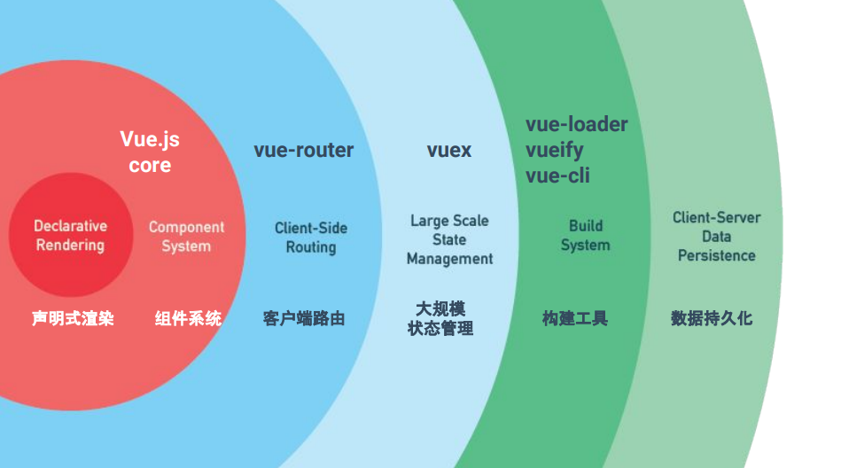
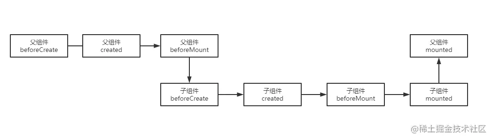

## 开始

</img>

## 模板语法

+ ::: v-pre
  `{{ xxx }}`:插值表达式（Mustache 语法），`xxx` 为 `js `表达式。
  ::: 

<RecoDemo>
  <template slot="code-template">
    <<< @/docs/.vuepress/components/Mustache.vue?template
  </template>
  <template slot="code-script">
    <<< @/docs/.vuepress/components/Mustache.vue?script
  </template>
  <template slot="code-style">
    <<< @/docs/.vuepress/components/Mustache.vue?style
  </template>
  <Mustache slot="demo"/>
</RecoDemo>

## 渐进式框架

`Vue` 从设计角度来讲， 虽然能够涵盖这张图上所有的东西，但是你并不需要一上手就把所有东西全用上(**`主张最少`**) ，因为没有必要。无论从学习角度，还是实际情况，这都是可选的。**声明式渲染**和**组件系统**是` Vue `的核心库所包含内容，而**客户端路由**、**状态管理**、**构建工具**都有专门解决方案。这些解决方案相互独立，你可以在核心的基础上任意选用其他的部件，不一定要全部整合在一起。



+ 声明式渲染：DOM 随状态（数据）更新而更新。（声明式：关注结果，命令式：关注过程（jQuery））

---


## `mvvm` 框架

- 虽然没有完全遵循 [MVVM 模型](https://zh.wikipedia.org/wiki/MVVM)，但是` Vue `的设计也受到了它的启发。因此在文档中经常会使用 `vm`(`ViewModel `的缩写) 这个变量名表示 `Vue `实例。通过用 `Vue` 函数创建一个新的**`Vue` 实例**。

  ```js {}
  var vm = new Vue({
    // 选项
  });
  ```

- **`MVVM`**（**`Model–view–viewmodel`**）是一种软件[架构模式](https://zh.wikipedia.org/wiki/架构模式)，`MVVM `支持双向绑定，意思就是当 M 层数据进行修改时，`VM `层会监测到变化，并且通知 V 层进行相应的修改，反之修改 V 层则会通知 M 层数据进行修改，以此也实现了视图与模型层的相互解耦。View 的变动，自动反映在` ViewModel`，反之亦然。

- 关系图

  

- 响应式原理

  1. 侵入式：`this.a++`(不调用方法)

     非侵入式：`this.setState({a:this.state.a++})`(调用方法)

  2. [Object.defineProperty()](https://developer.mozilla.org/zh-CN/docs/Web/JavaScript/Reference/Global_Objects/Object/defineProperty)

     ```js
     //基本使用
     let obj = { b: 5 };
     Object.defineProperty(obj, "a", {
       //    value:5, //设置值
       //    writable: false, //是否可写(是否能被修改)
       //    enumerable:false,//是否可被枚举(循环对象是否能被输出)
       get() {
         console.log("访问a");
         return 6; //return的值是设置a的属性，没有return,下次访问a是undifined
       },
       set(newValue) {
         console.log("设置a");
         console.log(newValue); //被设置的值被当做参数传入set
       },
     });
     obj.a = 7;
     console.log(obj.a); //a=6,访问时又走了get,在使用临时变量保存改变的值，在set的时候赋值给临时变量，get中返回临时变量
     ```

     ```js
     //getter/setter需要临时变量周转才能工作
     let obj = {};
     let temp;
     Object.defineProperty(obj, "a", {
       get() {
         console.log("访问a");
         return temp;
       },
       set(newValue) {
         console.log("设置a");
         temp = newValue;
       },
     });
     obj.a = 7;
     console.log(obj.a);
     ```

     ```js
     //封装成函数defineReactive
     let obj = {};
     function defineReactive(data, key, val) {
       //data:数据对象，key:键值，val替代临时变量
       //函数外部可以访问val的值，get和set闭包中的环境
       Object.defineProperty(data, key, {
         enumerable: true, //可枚举
         configurable: true, //可改变或删除
         get() {
           console.log("访问" + key);
           return val;
         },
         set(newValue) {
           console.log("设置" + key);
           if (val == newValue) return;
           val = newValue;
         },
       });
     }
     defineReactive(obj, "a", 10);
     obj.a = 4;
     console.log(obj.a);
     ```
  
  3. 对象代理
  
     ```js
     function Vue(options) {
         let _data = options.data()
         let _this = this
         Object.keys(_data).forEach(i => {//代理对象添加到实列原型
             Object.defineProperty(_this, i, {
                 get() {
                     console.log('Get'+i)
                     return _data[i]
                 },
                 set(newValue) {
                     _data[i]=newValue
                     return newValue
                 }
             })
         })
     
     }
     let vm = new Vue({
         data() {
             return {
                 name: 'Blueless Bird',
                 author: 'Joni'
             }
         }
     })
     vm.name='Hey Boi.'
     console.log(vm.name)
     ```
  
  4. 其他
  
     ```js
     //this.$options.data().xxx获取初始值
     //el > $mount
     //render > template 替换el的内容
     ```

---


## 生命周期函数

- 在某一时刻自动执行的函数（也叫钩子函数）

- 图谱

  

- > 1.  `beforeCreate`在初始化 / 实例创建 之前执行的函数
  > 2.  `Created`在初始化 / 实例创建 之后执行的函数,可以访问methods， data， computed等上的方法和数据
  > 3.  `beforeMount`在组件内容被渲染到页面之前自动执行的函数
  >
  > （注意：可获取到`vm.el`，但并未挂载）
  >
  > 4.  `Mounted`在组件内容被渲染到页面之后自动执行的函数
  > 5.  `beforeUpdate`在数据将要变化之前自动执行的函数
  > 6.  `updated`在数据发生变化之后自动执行的函数
  > 7.  `beforeUnmount`在` VUE `实例销毁之前自动执行的函数
  > 8.  `unmounted`在` VUE` 实例销毁之后自动执行的函数
  > 9.  `errorCaptured` 捕获一个来自子孙组件的错误时被调用

::: warning
不要在选项 property 或回调上使用[箭头函数](https://developer.mozilla.org/zh-CN/docs/Web/JavaScript/Reference/Functions/Arrow_functions)，比如 `created: () => console.log(this.a)` 或 `vm.$watch('a', newValue => this.myMethod())`。因为箭头函数并没有 `this`，`this`会作为变量一直向上级词法作用域查找，直至找到为止，经常导致 `Uncaught TypeError: Cannot read property of undefined` 或 `Uncaught TypeError: this.myMethod is not a function` 之类的错误。
:::

- hook

  ```javascript
  export default{
    methods:{
      fn(){
        const timer = setInterval(()=>{
          //具体执行代码
          console.log('1');
        },1000);
        this.$once('hook:beforeDestroy',()=>{
          clearInterval(timer);
          timer = null;
        })
      }
    }
  }
  ```

  ```javascript
  //父组件
  <rl-child @hook:mounted="childMountedHandle"
  />
  //vue3 改为@vnode-updated
  method () {
    childMountedHandle() {
    // do something...
    }
  },
  ```
  
- 父子组件生命周期执行顺序

  **初始化：**
  
  

  原理：子组件作为父组件的DOM子节点，父组件实例化完成后要挂载这个父组件，调用父组件的render方法方向有子组件，则去 创建渲染子组件并缓存（因为可能有多层），子组件都完成完成父组件的挂载 子组件挂载完成后，父组件还未挂载

  **更新** 同理：先完成子组件的更新，再完成父组件

  父beforeUpdate -> 子beforeUpdate -> 子updated -> 父updated

  **销毁**

  父beforeDestroy -> 子beforeDestroy -> 子destroyed -> 父destroyed

---


## 计算属性

- 计算属性：依赖 data 中的数据进行计算，与 methods 不同的是只有**响应式依赖**发生改变时才进行重新计算(计算属性是基于它们的响应式依赖进行缓存的)。**模板内的表达式非常便利，但是设计它们的初衷是用于简单运算的。在模板中放入太多的逻辑会让模板过重且难以维护。**

  ::: demo

  ```vue
  <div>{{nmu1}}</div>
  <script>
      export default {
          data() {
              return {
                  num: 1,
              };
          },
          computed: {
              nmu1() {
                  //this指向vm实例，需要使用函数声明
                  return this.num + 1;
              },
          },
      };
  </script>
  ```

  ::: 

- 计算属性的 getter 和 setter

  当我们取计算属性值的时候会执行 get 方法（模板使用），设置的时候会执行 set 方法，computed 属性默认为 getter，但是它还提供了 setter，可以由因变量去影响自变量。

  ::: demo
  
  ```vue
  <template>
  <input v-model="fullname" type="text" />
  <p>{{fullname}}</p>
  </template>
  <script>
      export default {
          data() {
              return {
                  firstName: "wang",
                  lastName: "cai",
              };
          }, //可以return fuc传参
          computed: {
              fullname: {
                  //这时fullname是对象
                  get: function () {
                      console.log("设置值");
                      return this.firstName + this.lastName;
                  },
                  set: function (value) {
                      console.log(value); //这里的value是fullname
                      this.firstName = "zhang"; //当改变fullname时执行set函数
                      this.lastName = "shang";
                  },
              },
          },
      };
  </script>
  ```
  
  ::: 

---


## 侦听器

- 监听属性，属性变化时，自动执行里面的函数，参数：`current`（现在参数的值），`prev`（以前参数的值）

  ```vue
  <input v-model="firstName" type="text" />
  <p>{{fullname}}</p>
  <script>
    export default {
      watch: {
        firstName: function (n, o) {
          //改变firstName，执行函数,改变fullname
          this.fullname = n + this.lastName;
          console.log(o);
        },
      },
    };
  </script>
  ```

- 深度监听

  1. `handler`方法和` immediate `属性

     最初绑定的时候是不会执行的，要等到 `firstName` 改变时才执行监听计算,修改一下 watch 写法使其初绑定的时候就执行。

     ```vue
     watch: {
         firstName: {
             handler(n, o) {
                 this.fullname =n+this.lastName
                 console.log(o)
             },
                 immediate:true
         },
     },
     ```

  2. `deep `属性

     `watch `里面还有一个属性 `deep`，默认值是 `false`，代表是否深度监听。

     ```vue
     <input v-model="obj.a" type="text" />
     <p>{{ obj.a }}</p>
     <script>
       export default {
           data(){
               return {
                   obj: { a: 123 },
               }
           }
           watch: {
           obj: {
           handler() {
               this.obj.a = 567;
               console.log("change");
           },
               //immediate: true,
               deep: true
       //obj.a变化时执行函数，给对象的所有属性都加上监听器
       },
       },
       }
     </script>
     ```

     ```js
     //优化，使用字符串形式监听
     watch: {
         'obj.a': { //只给obj.a加监听器
             handler() {
                 console.log("change");
             },
                 immediate: true,
                     deep: true
         },
     },
     ```

3. 注销 watch

   watch 写在组件中，会随着组件的销毁而销毁。如果使用下面这样的方式写 watch，那么就要手动注销。

   ```js
   const unWatch = app.$watch("text", (newVal, oldVal) => {
     console.log(`${newVal} : ${oldVal}`);
   }); //返回unWatch方法

   unWatch(); // 手动注销watch
   ```

4. watch 监听路由

   可以使用 watch 来进行路由的监听

   ```js
   watch: {
     changeShowType(value) {
         console.log("-----"+value);
     },
         '$route'(to,from){
             console.log(to);   //to表示去往的界面
             console.log(from); //from表示来自于哪个界面
             if(to.path=="/shop/detail"){
                 console.log("商品详情");
             }
         }
   },
   ```

---


## 过滤器

用于一些常见的文本格式化，用在双花括号插值和 `v-bind` 表达式中。

::: demo

```html
{{date|format("prop")}}
<!-- date作为format函数的参数，format也可以传参 -->
<script>
  export default {
    data() {
      return {
        date: new Date(),
      }
    },
    filters: {
      format: function (value, prop) {
        //格式化日期
        //console.log(prop);
        const Y = value.getFullYear();
        const M = value.getMonth() + 1;
        const D = value.getDate();
        const times = Y + (M < 10 ? "-0" : "-") + M + (D < 10 ? "-0" : "-") + D;
        return times;
      },
    },
  };
</script>
```

::: 

<hr>

## 指令

- **v-text**

  1. 与花括号的区别是在页面加载时不显示{{}}。

  2. 在{{ }}的前后可以添加其他的内容,而在 v-text 里面不行。

- **`v-html`**

  更新元素的 `innerHTML`

  ::: demo 

  ```html
  <p v-html="msg"></p>
  <script>
    export default {
      data() {
        return {
          msg: "<input/ placeholder='这是一个输入框'>",
        };
      },
    };
  </script>
  ```

  ::: 

  **注意**

  1. 在网站上动态渲染任意 HTML 是非常危险的，因为容易导致 [XSS 攻击](https://en.wikipedia.org/wiki/Cross-site_scripting)。只在可信内容上使用 `v-html`，**永不**用在用户提交的内容上。
  2. 在[单文件组件](https://cn.vuejs.org/v2/guide/single-file-components.html)里，`scoped` 的样式不会应用在 `v-html` 内部，因为那部分 HTML 没有被 Vue 的模板编译器处理。如果你希望针对 `v-html` 的内容设置带作用域的 CSS，你可以替换为 [CSS Modules](https://vue-loader.vuejs.org/en/features/css-modules.html) 或用一个额外的全局 `<style>` 元素手动设置类似 BEM 的作用域策略。
  3. [浅谈XSS攻击的那些事](https://zhuanlan.zhihu.com/p/26177815)

- **v-show**

  根据变量控制 dom 显示与隐藏，变量为 false 时,display:none,`v-show` 不支持 `<template>` 元素，也不支持 `v-else`。

- **v-if**

  根据变量控制 dom 显示与隐藏，变量为 false 时,直接移除 dom 元素。`v-if` 与 `v-for` 一起使用时，`v-for` 具有比 `v-if` 更高的优先级。

- **v-bind**

  缩写：`:`绑定 html 标签中的属性值。

  ```vue
  <a :[type]="'http://www.baidu.com'">百度</a>
  <!--写静态要在""中加''-->
  <br />
  <a :[type]="url">百度</a>
  <script>
    export default {
      data() {
        return {
          type: "href",
        };
      },
    };
  </script>
  ```
  
- **v-on**

  缩写： `@`事件监听器，

  1. 事件修饰符：`@click.prevent`（阻止默认行为）
  2. 模板中绑定事件：`<Son @click=‘handleClick’> \</Son>`
  3. `$event`传递原生事件：`hanclick(count,$event)`，不传参数，第一个参数为e
  
- ##### 修饰符

  `表单`：lazy，trim，number

  `事件`：stop(冒泡)，prevent(阻止默认)，capture(捕获，使事件触发从包含这个元素的顶层开始往下触发)，once(只触发一次)，self(只当在 event.target 是当前元素自身时触发处理函数),passive(onscroll事件加一个.lazy),native(监听根元素的原生事件)

  `鼠标、键盘`:left、right、middle：鼠标左、右、中键点击,keycode：对应键盘码

---

## 样式绑定

1. 字符绑定：在 data()在定义变量，v-bind 绑定属性

   ::: demo

   ```vue
   <div :class="str">{{message}}</div>
   <script>
     export default {
       data() {
         return {
           str: "red",
           message: "给时光以生命，给岁月以文明",
         };
       },
     };
   </script>
   <style>
     .red {
       color: red;
     }
     .green {
       color: green;
     }
   </style>
   ```

   ::: 

2. 对象绑定：传给` :class` 一个对象

   ::: demo

   ```vue
   <div :class="{ red:isRed, blue:isBlue }">{{message}}</div>
   <script>
       export default {
           data() {
               return {
                   message: "给时光以生命,而不是给生命以时光",
                   isRed: false,
                   isBlue: true, //根据isBlue的值控制样式
               };
           },
       };
   </script>
   <style>
       .red{
           color:red;
       }
       .blue{
           color:skyblue
       }
   </style>
   ```

   :::

   或者

   ```html
   <div :class="{ red:false,green:true}">{{message}}</div>
   ```

3. 数组绑定：把数组传给 `:class`

   ```html
   <div :class="['red', 'active']">{{ message }}</div>
   ```

   或者 data()中定义数组

   ::: demo

   ```vue
   <div :class="classArray">{{ message }}</div>
   <script>
       export default {
           data() {
               return {
                   message: "或许是不知梦的缘故，流离之人追逐幻影。",
                   classArray: ["pink", "active"],
               };
           },
       };
   </script>
   <style>
       .pink{
           color:pink;
       }
       .active:hover{
           font-weight:bold
       }
   </style>
   ```

   ::: 

4. 行内动态样式

   1. 字符串形式

      ::: demo

      ```vue
      <div :style="red">{{ message }}</div>
      <script>
          export default {
              data() {
                  return {
                      message: "The closer you look,the less you see.",
                      red: "color:gold", //字符串样式
                  };
              },
          };
      </script>
      ```

      ::: 

   2. 对象形式

      ::: demo

      ```vue
      <div :style="styleObj">{{ message }}</div>
      <script>
        export default {
          data() {
            return {
              message: "These violent delights have violent ends",
              styleObj: { color: "greenYellow " }, //对象样式
            };
          },
        };
      </script>
      ```

      ::: 

   其他

   ::: demo

   ```vue
   <el-button :style="list[types]" @click="change" ref="btn">点击变色</el-button>
   <script>
       export default {
           data() {
               return {
                   list:[
                       "backgroundColor:red",
                       "backgroundColor:blue",
                       "backgroundColor:yellow"],
                   types:1
               };
           },
           methods: {
               change(){
                   this.types=++this.types%3
               }
           }
       }
   </script>
   ```

   ::: 

   ::: demo

   ```vue
   <el-button
           :class="{red:types==0,
                   blue:types==1,
                   yellow:types==2}"
           @click="types=++types%3"
           ref="btn"
           >
       点击变色
   </el-button>
   <script>
       export default {
           data() {
               return {
                   list:["red","blue","yellow"],
                   types:0
               };
           }
       }
   </script>
   ```

   ::: 

---


## 列表循环

- v-for:循环可迭代对象（数组，对象，字符串，数字）,`vue` 要求增加 key 值**（字符串、数值）**避免重复渲染。

  ::: demo

  ```vue
  <li v-for="(item,index) in list" :key="index">{{item}}</li>
  <script>
    export default {
      data() {
        return {
          list: [
            "零化域的缺失之环",
            "闭时曲线的碑文",
            "对偶福音的规约",
            "模糊像散的孤独",
            "二律背反的双重人格",
            "永劫回归的潘多拉",
            "回折叙唱的鹅妈妈",
            "盟誓的文艺复兴",
          ],
        };
      },
    };
  </script>
  ```

  :::

  <blockquote style="border-left: 4px solid #f66;">
      <p>index 作为 key,逆序添加、逆序删除会导致key发生变化当成新的节点，产生没有必要的真实 DOM 更新</p>
  </blockquote>

- 数组方法：

  <blockquote style="border-left: 4px solid #42b983;">
  <p>1. push()：从数组尾部添加内容</p>
  <p>2. unshift()：从数组头部添加内容</p>
  <p>3. pop()：从数组末尾删除内容</p>
  <p>4. shift()：从数组头部删除内容</p>
  <p>5. sort()：对数组进行排序</p>
  <p>6. reverse()：对数组进行取反</p>
  <p>7. splice()：从数组中筛出具体的内容</p>
  </blockquote>
  
- 循环与判断不写在同一标签上，`v-for` 的优先级比 `v-if` 更高。

---

## 虚拟DOM

+ JS按照DOM结构来实现的树形结构对象

  ```mermaid
  graph LR
  A(数据改变)-->B(虚拟dom计算变更)-->C(真实dom)-->D(视图更新)
  ```

  ```typescript
  //snabbdom
  import {init, classModule,propsModule, styleModule,eventListenersModule, h} from "snabbdom"; //使用snabbdom库
  const patch = init([classModule, propsModule, styleModule, eventListenersModule]); //初始化patch函数
  const vNode = h("ol", {}, [
      //标签，属性，孩子节点/文本节点(children和text只会存在一个)
      h("li", null, "one"),
      h("li", null, "two"),
  ]);//h函数创建vNode并返回
  const container = document.getElementById("container");//容器
  patch(container, vNode); //将vnode替换空容器,如果patch第一个参数为真实dom，创建vnode并关联dom
  const newVnode = h("ol", null, [
      h("li", null, "one"),
      h("li", null, "two"),
      h("li", null, "three"),
  ]);
  patch(vNode, newVnode)//更新dom,vNode已关联dom
  ```

+ diff

  <blockquote style="border-left: 4px solid #42b983;">  
      <p>同级比较：Diff算法比较只会在同层级进行, 不会跨层级比较</p>
      <p>patch：对比当前同层的虚拟节点是否为同一种类型的标签，是继续执行patch进行深层比对，不是把节点替换成新虚拟节点</p>
      <p>sameVnode:判断是否为同一类型节点(key值，标签名。。。)</p>
  </blockquote>

---

## 双向绑定

- `v-modle`:本质上是语法糖

  1. `text` 和` textarea` 元素使用 `value` property 和 `input` 事件；
  2. `checkbox` 和 `radio `使用 `checked` property 和 `change` 事件；
  3. select 字段将 `value` 作为 prop 并将 `change` 作为事件

  ::: demo

  ```vue
  <input type="text" v-model="message" size="30"/>
  <p>{{message}}</p>
  <script>
      export default {
          data() {
              return {
                  message: '记忆就像镜子，映照出灵魂的模样。',
              };
          },
      }
  </script>
  ```

  :::

  ::: demo 原理

  ```vue
  <input type="text" :value="text" @input="text=$event.target.value" size="50"/>
  <!--value绑定值，input事件获取输入框输入的内容赋值给text-->
  <!--$event是事件对象，$event.target则指的是事件触发的目标，即哪一个元素触发了事件，这将直接获取该dom元素 -->
  <p>{{text}}</p>
  <script>
      export default {
          data() {
              return {
                  text: 'An act of creation always begins with an act of destruction.',
              };
          },
      }
  </script>
  ```

  :::

- 修饰符

  `v-model.lazy` 失去焦点才触发双向绑定

  `v-model.number` 用户输入的值自动转变为 number 类型

  `v-model.trim `去掉字符串前后空格

- `.sync` 修饰符

  类似于`v-modle`，也是一个语法糖，使子组件能够修改父组件的值，不限制标签

  ```vue
  <!--父组件-->
  <div id="app">
    .sync的使用
    <el-button v-if="!show" @click="show=true">显示</el-button>
    <Son :visible.sync="show" />
    <!--:visible.sync="show"是
  @update:visible="（val）=>{show = val}" 和             
  :visible="show"的语法糖-->
  </div>
  <script>
    import Son from "./components/Son.vue";
    export default {
      name: "App",
      data() {
        return {
          show: false,
        };
      },
      components: {
        Son,
      },
    };
  </script>
  ```

  ```vue
  <!--子组件-->
  <div v-if="visible">
    对话框
    <el-button @click="$emit('update:visible', false);">隐藏</el-button>
    <!--触发update:visible事件改变父组件的值-->
  </div>
  <script>
    export default {
        name: "Son",
        data(){
            return {
            },
                props: {
                    visible: { type: Boolean, default: false },
                },
        }
  </script>
  ```

---


## 组件

- 组件注册(定义==>注册==>使用)

  1. 定义子组件(子组件必须要有唯一的根标记)

     ```vue
     <div>我是子组件</div>
     <script>
       export default {
           name: "Son",
           data(){
               return {//一个组件的 data 选项必须是一个函数,如果 Vue 没有这条规则，就会影响到其它所有实例
               }
           }
     </script>
     ```

  2. 注册组件

     ```js
     //根组件中全局注册
     /*Vue.component('my-component-name', {
       // ... 选项 ...
     })*/
     import Son from "./components/Son.vue";
     import Vue from "vue";
     Vue.component("Son", Son);
     //组件命名 大驼峰引入，大驼峰或横线注册，html中大驼峰或横线使用
     ```

     ```vue
     <!--父组件中局部注册并使用-->
     <div>
       我是父组件
       <Son />
       <Son />
     </div>
     <script>
       import Son from "./components/Son.vue";
       import Son1 from "./components/Son1.vue";
       export default {
         components: {
           Son,
           //"Son":Son简写,为了和普通变量区分，建议首字母大写
           Son1,
         },
       };
     </script>
     ```

- 父子组件通信

  ### 父子组件的关系可以总结为`prop`向下传递，`事件`向上传递。

  1. 父组件通过自定义属性传值，子组件`props`接收.

     `camelCase `(驼峰命名法) 的 `prop` 名需要使用其等价的 kebab-case (短横线分隔命名) 命名

     不能修改传递过来的数据

     ```vue
     <!--父组件-->
     <div id="app">
       我是父组件
       <Son :message="msg" />
       <!--使用v-bind绑定动态Prop-->
       <Son :message="msg1" />
     </div>
     <script>
       import Son from "./components/Son.vue";
       export default {
         name: "App",
         data() {
           return {
             msg: "hello!",
             msg1: "Son",
           };
         },
         components: {
           Son,
         },
       };
     </script>
     ```

     ```vue
     <!--子组件-->
     <div>{{ message }}</div>
     <script>
       export default {
           name: "Son",
           data(){
               return {
               },
                   props: ['message'],//以字符串数组形式列出的 prop,prop不能与data中的数据重名
           }
     </script>
     ```

     `Prop `验证:`props `为带有验证需求的对象,`prop `验证失败的时候， `Vue` 将会产生一个控制台的警告

     ```js
     props: {
         // 基础的类型检查 (`null` 和 `undefined` 会通过任何类型验证)
         propA: Number,
             // 多个可能的类型
             propB: [String, Number],
                 // 必填的字符串
                 propC: {
                     type: String,
                         required: true
                 },
                     // 带有默认值的数字
                     propD: {
                         type: Number,
                             default: 100
                     },
                         // 带有默认值的对象
                         propE: {
                             type: Object,
                                 // 对象或数组默认值必须从一个工厂函数获取
                                 default: function () {
                                     return { message: 'hello' }
                                 }
                         },
                             // 自定义验证函数
                             propF: {
                                 validator: function (value) {
                                     // 这个值必须匹配下列字符串中的一个
                                     return ['success', 'warning', 'danger'].indexOf(value) !== -1
                                 }
                             }
     }
     ```

  2. 子组件触发自定义事件传值

     ```html
     <!--子组件-->
     <button @click="increment">子组件（点击传值）</button>
     <script>
         export default {
             name: "Son",
             //如果向父组件传递的方法很多，可以在这里标识出来
             //emits 可以是数组或对象，从组件触发自定义事件，emits 可以是简单的数组，也可以是对象，后者允许配置事件验证。
             emits: ['increment'],
             methods: {
                 increment(){
                     this.$emit('increment',2,'第二个参数')//触发自定义事件传值,
                 },
             }
         }
     </script>
     ```
  
     ```html
     <!--父组件-->
     <div id="app">
         {{count}}
         <!--自定义事件，通过$emit触发-->
         <Son @increment="add" />
     </div>
     <script>
         import Son from "./components/Son.vue";
         export default {
             name: "App",
             components: { Son },
             data() {
                 return {
                     count: 0,
                 };
             },
             methods: {
                 add(value, sec) {
                     //触发事件时传的值
                     this.count += value;
                     console.log(value);
                     console.log(sec);
                 },
             },
         };
     </script>
     ```
     
  3. 父组件传方法，子组件调用
  
     ```vue
     <!--父组件-->
     <div id="app">
         {{count}}
         <Son :change="add" />
         <!--传递了add方法，父组件的方法能改变父组件的数据-->
     </div>
     <script>
         import Son from "./components/Son.vue";
         export default {
             name: "App",
             components: { Son },
             data() {
                 return {
                     count: 0,
                 };
             },
             methods: {
                 add(value) {
                     //子组件调用时传值
                     this.count += value;
                     console.log(value);
                 },
             },
         };
     </script>
     ```
     
  4. ref 属性
  
     ```vue
     <!--子组件-->
     <div>子组件</div>
     <script>
         export default {
             name: "Son",
             data(){
                 return {
                     message:'子组件数据',
                 },
             }
     </script>
     ```
  
     ```vue
     <!--父组件-->
     <div id="app">
         {{msg}}
         <Son ref="son" />//绑定ref
     </div>
     <script>
         import Son from './components/Son.vue'
         export default {
             name: 'App',
             components: {Son}
             mounted(){
                 this.msg=this.$refs.son.message
                 console.log(this.$refs.son.message)
                 //通过$refs获取组件实例，得到组件数据和方法
             },
                 data(){
                     return{
                         msg:'',
                     }
                 },
     
         }
     </script>
     ```
  
  5. slot 插槽
  
     父组件控制插槽是否显示、怎样显示，子组件控制槽在哪显示（占位符）
  
      `slot`写在组件`template`的什么位置，父组件传过来的模板将来就显示在什么位置。
  
     ```vue
     <!--父组件-->
     <div id="app">
         父组件
         <Son @change="add">插槽内容：{{msg}}</Son>
         <!--标签内容显示在子组件的<solt>元素位置，插槽内可以包含其他html标签或其它的组件，作用域为父组件作用域，没有<solt>元素则废弃标签内容-->
     </div>
     <script>
         import Son from './components/Son.vue'
         export default {
             name: 'App',
             components: {Son}
             data(){
                 return{
                     msg:'父组件数据',
                 }
             },
     
         }
     </script>
     ```
  
     ```vue
     <!--子组件-->
     <div>子组件</div>
     <slot>默认内容</slot>
     <!--父组件什么都不写的话显示默认内容-->
     <!--一个不带name的<slot>出口会带有隐含的名字“default”-->
     <!--任何没有被包裹在带有 v-slot 的 组件标签 中的内容都会被视为默认插槽的内容-->
     <!--v-slot只能添加在<template>上或自定义组件上(只有一种例外情况)-->
     ```
  
     具名插槽:`< slot name=”mySlot”>`有命名时，组件标签中使用属性`slot=”mySlot”`的元素就会替换该对应位置内容
  
     ```vue
     <!--父组件-->
     <Son>
         <div slot="header">头部</div>
         <!--标签内部什么都不写显示默认内容-->
         <div slot="content">内容</div>
         <!--新写法`#`为`v-slot:`的缩写-->
         <div #footer>页脚</div>
     </Son>
     ```
  
     ```vue
     <!--子组件-->
     <slot name="header">默认内容</slot>
     <slot name="content">默认内容1</slot>
     <slot name="footer">默认内容2</slot>
     ```
  
     作用域插槽：子传父传参的方式，解决了普通`slot`在 parent 中无法访问 child 数据的问题
  
     父级模板里的所有内容都是在父级作用域中编译的；子模板里的所有内容都是在子作用域中编译的。
     
     ```vue
     <!--子组件-->
     <h1>子组件</h1>
     <slot :data="list" name="son">{{def}}</slot>
     <!--子组件把list传递给插槽，不写name,name为fefault-->
     <script>
         export default {
             name: "Son",
             data(){
                 return {
                     def:'默认内容',
                     list: [
                         "起源与终结的序章","时空跳跃的妄想症",
                         "并列过程的偏执狂","空理彷徨的会谈",
                         "电荷冲突的接点","蝶翼的偏差值",
                         "断层的变动率","梦幻的自平衡",
                         "时空境界的信条","自我相似的雌性同株",
                         "形而上的坏死","虚像歪曲的混合",
                         "因果律的溶解","镜面上的命运石之门"
                     ],
                 },
             }
     </script>
     ```
     
     ```vue
        <!--父组件-->
      <Son>
          <template #son="prop">
            <!--父组件使用一个变量来接收，这里变量为prop(随便取名),也可以解构{list},prop作为参数传入函数-->
            <li v-for="(v,i) in prop.list" :key="i">{{v}}</li>
          </template>
        </Son>
     ```
     
      https://juejin.cn/post/6954284127528943629
     
      http://www.jianboge.com/d148386
  

---

## 动态组件 & 异步组件

+ 动态组件：通过动态属性`is`结合`component`标签实现，<component /:is="xxxx"  />，通常和`keep-alive`一起使用保持组件状态，is的值为组件名、组件对象或函数式组件。

  ::: demo

  ```vue
  <div>
      <div v-for="(v, i) in list" :key="i">
          <component :is="v.type" />
      </div>
  </div>
  <script>
      const Component1 = {
          render(h) {
              return <span>Component1</span>;
          },
      };
      const Component2 = {
          render(h) {
              return <span>Component2</span>;
          },
      };
      export default {
          data() {
              return {
                  list: [
                      { type: "Component1" },
                      { type: "Component2" },
                      { type: "Component1" },
                      { type: "Component1" },
                  ],
              };
          },
          components: {
              Component1,
              Component2,
          },
      };
  </script>
  ```

  :::

  ::: demo

  ```vue
  <!--缓存组件（子组件为input）-->
  <!--使用keep-alive缓存组件状态，切换时input框输入的内容还存在-->
  <div>
      <keep-alive>
          <component :is="com" />
      </keep-alive>
      <el-button @click="change">change</el-button>
  </div>
  <script>
      const Component1 = {
          data() {
              return {
                  value: "Component1",
              };
          },
          render(h) {
              return <input v-model={this.value} />;
          },
      };
      const Component2 = {
          data() {
              return {
                  value: "Component2",
              };
          },
          render(h) {
              return <input v-model={this.value} />;
          },
      };
      export default {
          data() {
              return {
                  com: "Component1",
              };
          },
          components: { Component1, Component2 },
          methods: {
              change() {
                  this.com === "Component1"
                      ? (this.com = "Component2")
                  : (this.com = "Component1");
              },
          },
      };
  </script>
  ```

  :::

+ 异步组件:异步执行某些组件逻辑，加载页面时会下载所有组件代码，异步组件类似路由懒加载（按需加载），优化性能。

  ```vue
  <!--基本使用-->
  <div id="app">
    异步组件的使用
    <button @click="show=!show">{{show?'隐藏':'显示'}}</button>
    <Son v-if="show" />
  </div>
  <script>
        import Son from './components/Son.vue'
        export default {
            name: 'App',
            components: {
                Son:()=>(import(/*webpackChunkName:'Son'*/'./components/Son.vue')),
    //当show为true时才加载js代码并缓存代码，webpackChunkName可以给该js文件取名
            }
            data(){
                return{
                    show: false,
              }
            },
  
        }
   </script>
  ```

  ```vue
  <!--异步组件工厂函数-->
  <div id="app">
      异步组件的使用
      <button @click="show=!show">{{show?'隐藏':'显示'}}</button>
      <AsyncComponent v-if="show" />
  </div>
  <script>
      import Error from './components/Error.vue'
      import Loading from './components/Loading.vue'
      import Son from './components/Son.vue'
      //异步组件工厂函数
      const AsyncComponent=()=>({
          component:import (/*webpackChunkName:'Son'*/'./components/Son.vue'),//promise对象
          loading:Loading,
          error:Error,
          delay:200,//延迟200ms（先显示loading组件）
          timeout:3000//超过3000ms显示error组件
      })
      export default {
          name: 'App',
          components: {
              AsyncComponent
          }
          data(){
              return{
                  show: false,
              }
          },
  
      }
  </script>
  ```

  vue3 使用辅助函数`defineAsyncComponent`声明，`component` 选项更名为`loader`，选项可以添加`onErorr`回调重试

+ 动态异步组件

  ```js
  //组件对象
  const loading = {
      name: "loading",//keep-alive排除组件
      template:
      '<div >加载中....</div>',
  };
  const error = {
      name: "error",
      template:
      '<div >加载错误</div>',
      inject: ["reload"],
      created() {
          this.reload && this.reload(); //重试
      },
  };
  const component = {
      template:
      '<div >I am async!</div>',
  };
  ```

  ```Vue
  <keep-alive :exclude="['error', 'loading']">
      <!-- keep-alive需要排除error,loading组件-->
      <component
                 :is="AsyncComponent"
                 ></component>
  </keep-alive>
  <script>
      export default {
          data() {
              return {
                  attempts: 0,
                  isGetCom: false,
              }
          },
          computed: {
              AsyncComponent(){
                  return () => ({
                      component: new Promise((resolve) => {
                          setTimeout(() => {
                              resolve(component);
                          }, 1500);
                      }),
                      error,
                      loading,
                      delay: 0,
                      timeout: 1000,
                  })
              }
          },
      }
  </script>
  ```
  
+ 异步组件失败解决

  ```vue
  <!--method1:利用key刷新父组件-->
  <async-com :key="attempts" />
  <script>
      //vm.$forceUpdate()可以迫使 Vue 实例重新渲染。注意它仅仅影响实例本身和插入插槽内容的子组件，而不是所有子组件。
      //重要提示：这不会更新任何计算属性，调用`forceUpdate`仅仅强制重新渲染视图。
      import AsyncCom from "./components/AsyncCom.vue";
      export default {
          data() {return {
              attempts: 0,
              //key放动态组件上会因为timeou时间已过导致无限循环
          };
                 },
          provide: function () {
              return {
                  reload: this.reload,
                  //error组件中调用
              };
          },
          methods: {
              reload() {
                  if (this.attempts < 10) console.log("尝试次数", ++this.attempts);
              },
          },
          components: {
              AsyncCom,
          },
  </script>
  ```

  ```vue
  <!--method2:更新计算属性的依赖项更新计算属性，导致视图更新-->
  <script>
      export default {
          data() {return {
              attempts: 0,
          }},
          computed: {
              AsyncComponent() {
                  return () => ({
                      component, error,loading, delay: 0,timeout: 1000,
                      attempts: this.attempts,
                  })
              }
          },
          methods: {
              reload() {
                  if (this.attempts < 10) {
                      //与方法1类似error组件调用
                      console.log("尝试次数", ++this.attempts);
                  }
              },
          }
      }
  </script>
  ```

  ```vue
  <!--method3:获取组件后更新计算属性-->
  <script>
      let component//使用变量保存组件
      export default {
          data() {
              return {
                  isGetCom: false,//改变依赖触发计算属性更新
              }
          },
          computed: {
              AsyncComponent() {
                  if (!this.isGetCom) 
                      return () => ({
                          component: new Promise((resolve) => {
                              setTimeout(() => {
                                  const com={
                                      template:'<div>I am async!</div>',
                                  };
                                  component=com
                                  this.isGetCom=true//计算属性重新计算     
                                  //resolve(this.component);
                              }, 1500);
                          }),
                          error,
                          loading,
                          delay: 0,
                          timeout: 1000,
                      });
                  else return component;
              },
          }}
  </script>
  ```

---

## Mixin 混入

- 提取组件公共逻辑（包含任意组件选项如 data,mehoods,生命周期）

  ```js
  //定义minin
  export default {
      data() {
          return {
              dataCommomd: "公共数据",
          };
      },
      methods: {
          methodsCommomd() {
              console.log(this.type + "公共方法");
          },
      },
      mounted() {
          console.log("公共mounted");
      },
  };
  ```

  ```vue
  <!--子组件A(组件B类似)-->
  <template>
  <div>
      <button @click="methodsA">
          组件A方法
      </button>
      <button @click="methodsCommomd">
          公共方法
      </button>
      </div>
  </template>
  <script>
      import mixin from './mixin'
      export default {
          mixins:[mixin],
          data(){
              return{
                  aData:'组件A的数据',
                  type:"组件A"
              }
          },
          methods: {
              methodsA(){
                  console.log("组件A的方法")
              }
          },
          mounted(){
              console.log('组件A的mounted')
              console.log(this.type+this.dataCommomd)
          }
      }
  </script>
  ```

  ```vue
  <!--父组件-->
  <div id="app">
    <h1>Minin的使用</h1>
    <component-a />
    <hr />
    <component-b />
  </div>
  <script>
    import componentA from "./components/ComponentA.vue";
    import componentB from "./components/ComponentB.vue";
    export default {
      name: "App",
      components: {
        "component-a": componentA,
        "component-b": componentB,
      },
      data() {
        return {};
      },
    };
  </script>
  ```

- 优先级

  1. 数据和方法：组件 data ，methods 优先级高于 mixin data，methods 优先级
  2. 生命周期：生命周期函数，先执行 mixin 里面的，再执行组件里的
  3. 自定义的属性，组件中的属性优先级高于 mixin 属性的优先级

- 其他

  1. 局部` Mixin:mixins:[myMixin] `,` myMixin` 是一个自定义组件
  2. 全局 `Mixin：app.mixin( )`
  3. `Vue3 `中尽量避免使用` Mixin`，因为可以使用 `CompositionAPI` 来代替，可维护性更高。

---

## extends

---


## 依赖注入

祖先组件使用`provide`选项向后代提供数据/方法，后代组件通过`inject` 选项接收`property `，`property `是非响应式的。

```vue
<!--祖先组件-->
<Son />
<script>
    import Son from "./components/Son";
    const store = Vue.observable({ name: "张三" });
    export default {
        data() {
            return {
                msg: "Some people choose to see the ugliness in this world.The disarray.I choose to see the beauty",
                obj:{name:'dax1'},//同样是响应的
            };
        },
        provide: function () {//对象或返回一个对象的函数
            this.store = store;
            return {
                store: this.store,//如果你传入了一个可监听的对象，那么其对象的 property 还是可响应的
                msg: this.msg,
                parent: this, //当前组件实例
            };
        },
        mounted() {
            this.store.name = "李四";
        },
        components: {
            Son,
        },
    };
</script>
```

```vue
<!--后代组件-->
<div>{{this.msg}}</div>
<script>
  export default {
    inject: ["msg", "parent"],//一个字符串数组，或一个对象
    mounted() {
      console.log(this.parent);
    },
  };
</script>
```

---


## 事件总线

+ vue2

  ```js
  //定义eventbus
  //event-bus.js
  import Vue from "vue";
  export const eventBus = new Vue(); //eventBus就是一个Vue实例
  ```

  ```vue
  <!--组件1-->
  {{ age }}
  <el-button @click="add">加1</el-button>
  <script>
    import { eventBus } from "./event-bus.js"; //需要是同一个eventBus
    export default {
      data() {
        return {
          age: 18,
        };
      },
      methods: {
        add() {
          this.age++;
          eventBus.$emit("add-age"); //发送消息
        },
      },
    };
  </script>
  ```

  ```vue
  <!--组件2-->
  {{ age }}
  <el-button @click="add">加1</el-button>
  <script>
      import { eventBus } from "./event-bus.js";
      export default {
          data() {
              return { age: 18 }
          },
          methods: {
              add() {
                  this.age++;
              },
          },
          created() {
              eventBus.$on("add-age", () => {
                  this.age++;
              }); //接收消息
          },
          beforeDestroy() {
              // 如果没有提供参数，则移除所有的事件监听器；
              // 如果只提供了事件，则移除该事件所有的监听器；
              // 如果同时提供了事件与回调，则只移除这个回调的监听器。
              eventBus.$off("add-age", () => {
                  this.age++;
              });
          },
      };
  </script>
  ```

+ vue3

  ```js
  //使用mitt
  import mitt from 'mitt'
  app.config.globalProperties.$bus = mitt();
  ```

  ```vue
  <!--组件1触发-->
  <script lang="ts" setup>
      import { getCurrentInstance } from "vue";
      const { proxy } = getCurrentInstance();
      function emit() {
          proxy.$bus.emit('message',{msg:'北海虽赊，扶摇可接'})
      }
  </script>
  ```

  ```vue
  <!--组件2监听-->
  <script lang="ts" >
     created() {
      this.$bus.on('search',(e:Object)=>{
          console.log(e);
      })
    },
  </script>
  ```

---

## directive

- 定义方法

  1. 全局：`app.directive('focus',{mounted(el){el.focus()}}) `

  2. 局部：局部指令需要在父组件注册后才可以使用

     `directives: { focus: { // 指令的定义 inserted: function (el) { el.focus() } } }`

  ```js
  //navActive.js
  export default {
    //指令就是对象
    bind: (el, bind) => {
      // console.log('bind')
      // console.log(el) el为指令绑定的dom元素
      // console.log(bind); bind.value可以拿到绑定指令传的值
      el.onclick = () => {
        //点击更改样式变红，获取父元素把重置兄弟元素样式
        el.className = "el-button el-button--danger";
        const children = Array.from(el.parentNode.children);
        children.forEach((v, i) => {
          if (i !== bind.value.index)
            v.className = "el-button el-button--default";
        });
      };
    },
  };
  ```

  ```vue
  <div>
    <!--3个按钮，指令传index,bing.value获取-->
    <el-button v-nav-active="{index:i}" v-for="(v,i) in 3" :key="i"
      >按钮{{v}}</el-button
    >
  </div>
  <script>
    import NavActive from "./navActive.js";
    export default {
      name: "Son",
      directives: {
        NavActive, //注册指令
      },
      data() {
        return {};
      },
    };
  </script>
  ```

- 生命周期函数

---


## **渲染函数**

字符串模板之外的另一种选择，允许你充分利用 JavaScript 的编程功能。

```vue
<!-- 不加:会解析为string类型 -->
<Son :leave=1>黄金色的树林里分出两条路，</Son>
<Son :leave=2>可惜我们不能同时去涉足，</Son>
<Son :leave=3>但我们却选择了，</Son>
<Son :leave=4>人迹罕至的那一条，</Son>
<Son :leave=5>这从此决定了</Son>
<Son :leave=6>我们的一生。</Son>
```

```vue
<p :style="`font-size:${fontSize}`"><slot/></p>
<script>
    export default {
        name: "Son",
        props: ["leave"],
        computed: {
            fontSize: function () {
                if (this.leave % 2) {
                    return 10 + (6 - this.leave) * 3 + "px";
                } else {
                    return 10 + (6 - this.leave) * 2 + "px";
                }
            },
        },
    };
</script>
```

使用render函数创建标签

::: demo

```vue
<div>
    <Son :leave="1">黄金色的树林里分出两条路，</Son>
    <Son :leave="2">可惜我们不能同时去涉足，</Son>
    <Son :leave="3">但我们却选择了，</Son>
    <Son :leave="4">人迹罕至的那一条，</Son>
    <Son :leave="5">这从此决定了</Son>
    <Son :leave="6">我们的一生。</Son>
</div>
<script>
    const Son = {
        name: "Son",
        props: ["leave"],
        render(h) {
            //h是createlement函数
            return h(`h${this.leave}`, this.$slots.default);
            // 或使用jsx语法
            // const tag = "h" + this.leave;
            // return (<tag>{this.$slots.default}</tag>);
        },
    };
    export default {
        name: "Test",
        components: { Son },
    };
</script>
```

:::

::: demo

```vue
<script> 
    export default {
        data() {
            return {
                list: [
                    "岁月流转，念念不忘，群碑未成，来日方长 ",
                    "日斜映影渐薄，犹待来者，重托衣钵 ",
                    "她实惠君良多，更有无穷，待君探索 ",
                    "此路或有蹉跎，君莫忘，必有灵犀相佐",
                ],
            };
        },
        props: {
            tag: { type: String, default: "ul" },
        },
        render(h) {
            //使用template也会被编译为render函数
            return h(
                this.tag, //也可以是一个组件
                {},
                this.list.map((i) => {
                    return h("li", { attrs: { style: "color:skyblue" } }, i); //需要return一个value
                })
            );
        },
    };
</script> 
```

:::

---


## Vue-Router路由


安装：Vue add router

- 根据 URL 的不同，展示不同的内容

  ```js
  //route/index.js文件
  import Vue from "vue";
  import Router from "vue-router";
  import layout from "../components/Layout.vue";
  import Son from "../components/Son.vue";
  import notFond from "../components/NotFond.vue";
  Vue.use(Router); //使用插件
  //该插件实现1.声明并全局注册router-link与router-view2.实现install:this.$router.push()
  export default new Router({
    //创建实例
    mode: "history", //路由模式，默认hash，history无#
    base: process.env.BASE_URL,
    //配置路由表（路由规则）
    routes: [
      {
        path: "/",
        name: "home",
        component: layout,
      },
      {
        path: "son",
        name: "son",
        component: Son,
      },
      {
        path: "*",
        name: "notFond",
        component: notFond,
      },
    ],
  });
  //匹配到path路径后找对应的component组件，在'router-view'处渲染
  //匹配不到路径渲染notFond组件
  ```

  ```js
  //还需要在main.js中将路由实例挂载给Vue实例
  import router from "./router/index.js";
  new Vue({ router, render: (h) => h(App) }).$mount("#app"); //添加配置项
  ```

  ```html
  <!--app.vue一级路由匹配到的组件将显示在路由出口-->
  <template>
    <router-view></router-view>
  </template>
  ```

- 动态路由

  路由传参，通过 route.param 接收

  ```js
  //路由index.js
  import Vue from "vue";
  import Router from "vue-router";
  const routes = [
    {
      path: "/",
      name: "home",
      component: layout,
      children: [
        {
          path: "/login",
          name: "login",
          component: Login,
        },
        {
          path: "/reg",
          name: "reg",
          component: Reg,
        },
        //动态路由，参数名为id
        {
          path: "/user/:id",
          name: "user",
          component: User,
        },
      ],
    },
    {
      path: "*",
      name: "notFond",
      component: notFond,
    },
  ];
  Vue.use(Router);
  export default new Router({
    mode: "history",
    base: process.env.BASE_URL,
    routes,
  });
  //解决重复点击报错
  const originalPush = Router.prototype.push;
  Router.prototype.push = function push(location) {
    return originalPush.call(this, location).catch((err) => err);
  };
  ```

  ```vue
  <!--user组件-->
  <template>
    <div>用户信息{{id}}</div>
  </template>
  <script>
    export default {
      data() {
        return {
          id: this.$route.params.id,
          //直接这么写页面上的id并不会变化,路由变化并不会重新创建组件，id是初始化的时候赋值的所以不会改变
        };
      },
      watch: {
        //监听路由或使用组件内路由守卫改变id
        $route(n, o) {
          this.id = n.params.id;
          console.log(o);
        },
      },
    };
  </script>
  ```

- 嵌套路由

  ```js
  //重新定义路由表
  routes: [
      {
          path: "/",
          name: "home",
          component: layout,
          children: [
              {
                  path: "/login",
                  name: "login",
                  component: Login,
              },
              {
                  path: "/reg",
                  name: "reg",
                  component: Reg,
              },
          ],
      },
      {
          path: "*",
          name: "notFond",
          component: notFond,
      },
  ],
  ```

  ```vue
  <el-container>
    <el-aside width="200px">Aside</el-aside>
    <el-container>
      <el-header>Header</el-header>
      <el-main
        >Main
        <!--点击跳转路由切换router-view内容-->
        <router-link to="/login">登录</router-link>
        <router-link to="reg">注册</router-link>
        <!--二级路由将显示在这-->
        <router-view></router-view>
      </el-main>
      <el-footer>Footer</el-footer>
    </el-container>
  </el-container>
  <!--配合element的Container布局容器-->
  ```

- 动态添加路由

  ```vue
  <el-container>
      <el-aside width="200px">Aside</el-aside>
      <el-container>
          <el-header>Header</el-header>
          <el-main
                   >Main
              <a @click="login">登录</a>
              <router-link to="/reg">注册</router-link>
              <router-link to="/new" v-if="isLogin">动态添加的路由</router-link>
              <router-view></router-view>
          </el-main>
          <el-footer>Footer</el-footer>
      </el-container>
  </el-container>
  <script>
  import New from "./New"; //新路由
  const newRouter = [
    {
      path: "/new",
      component: New,
    },
  ];
  export default {
    data() {
      return {
        isLogin: false,
      };
    },
    methods: {
      login() {
        this.isLogin = true;
        this.$router.push("/login");
        this.$router.addRoutes(newRouter);
      },
    },
  };
  </script>
  ```

  `addRoutes `添加的路由为一级路由，，如果是二级路，那要把父路由、祖先路由也带上，否则不会识别。`vue3 `改用 `router.addRoute`，可以添加一条新的路由规则记录作为现有路由的子路由。

- 导航守卫

  路由守卫用于路由跳转的一些验证

  1. 全局守卫：前置守卫：`beforeEach` 后置钩子：`afterEach`

  2. 单个路由守卫：独享守卫：`beforeEnter`

  3. 组件内部守卫：`beforeRouteEnter` `beforeRouteUpdate` `beforeRouteLeave`

  4. 所有的路由守卫都是三个参数（to，from，next）

     `to`： 要进入的目标路由（去哪儿）

     `from`： 要离开的路由（从哪来）

     `next`： 是否进行下一步（要不要继续）

  5. `next()`相当于 `next(true)` 放行，不写 相当于`next(false)`终止执行，`next(path)`跳转 例如：`next("/login")`，注意：后置钩子`afterEach`没有`next`参数

  ```js
  //main.js中设置全局路由前置守卫
  import router from "./router/index.js";
  // eslint-disable-next-line //忽略下行eslint校验
  const login = false;
  router.beforeEach((to, from, next) => {
    if (to.path !== "/user") next();
    //如果不去/user路由，放行
    else {
      if (login == true) {
        //如果登录，放行
        next();
      } else {
        //未登录跳转'/login'路由
        next("/login");
      }
    }
  });
  ```

  ```js
  //路由独享的守卫(进入这个路由之前)
  {
      path: "/user",
          name: "user",
              component: User,
                  // eslint-disable-next-line
                  beforeEnter: (to, from, next) => {
                      if (to.path !== "/user") next();
                      else {
                          if (login == true)  next();
                          else  next("/login");

                      }
                  },
  },
  ```

  ```html
  <!--组件内的守卫-->
  <div>用户信息</div>
  <script>
    const login = false;
    export default {
      data() {
        return {
          login: true,
          //不！能！获取组件实例 `this`,因为当守卫执行前，组件实例还没被创建
          //可以通过next(vm => {// 通过 `vm` 访问组件实例})
          //beforeRouteUpdate 和 beforeRouteLeave 来说，this 已经可用了，所以不支持传递回调
        };
      },
      beforeRouteEnter(to, from, next) {
        // eslint-disable-next-line
        if (login == true) next();
        else next("/login");
      },
    };
  </、script>
  ```

- api

  >$router全局对象
  >
  >push(path)
  >
  >replace(path)
  >
  >back()
  >
  >go(-1/1...)
  >
  >$route当前路由对象
  >
  >params
  >
  >query
  >
  >path
  >
  >name(路由表中定义)

- 其他

  1. <router-link to="/">Home</router-link> 模板中使用的路由跳转标签

  2. <router-view/>标签， 负责展示当前路由对应的组件内容

  3. 异步加载路由：component:( ) => import('../xxxx')

  4. 命名路由搭配 params，刷新页面参数会丢失

     ```js
     this.$router.push({ name: "news", params: { userId: 123 } });
     ```

     查询参数搭配 query，刷新页面数据不会丢失

     ```js
     this.$router.push({ path: "/news", query: { userId: 123 } });
     ```

---


## [vue-route原理](https://www.bilibili.com/video/BV1uv411E7aX?p=3)


```js
Vue.use(Router); //Router是插件,插件是函数或对象
// var a=function(){//第一个参数是vue构造函数
//console.log(vue);
//      console.log("function")
// }
var a = {};
a.install = function (vue) {
  //install方法的第一个参数是vue构造函数
  console.log(vue);
  console.log("install");
};
Vue.use(a); //use时会执行a中的代码，如果a有install属性，则执行install方法
```

```js
//vueRoute.js
let Vue;
class VueRoute {
    constructor(options) {
        // console.log(options);
        // this.current = "/";
        Vue.util.defineReactive(this, "current", "/"); //将current实现响应式
        console.log(this.current);
        this.routes = options.routes; //用户定义路由表
        this.modes = options.mode || "hash";
        this.init(); //监听路由改变
        this.push = () => {}; //...
    }
    init() {
        if (this.modes === "hash") {
            //第一次加载
            window.addEventListener("load", () => {
                this.current = location.hash.slice(1);
            });
            //地址栏改变时
            window.addEventListener("hashchange", () => {
                //通过hashchange监听
                this.current = location.hash.slice(1);
            });
        } else {
            //处理history
            //利用了 HTML5 History Interface 中新增的 pushState() 和 replaceState() 方法结合window.popstate事件（监听浏览器前进后退）。
            window.addEventListener('popstate',()=>{
            })
        }
    }
}
VueRoute.install = (_vue) => {
    Vue = _vue; //保存Vue
    //创建全局组件
    Vue.component("router-link", {
        props: {
            to: {
                //使用组件需要传href
                type: String,
                require: true,
            },
        },
        render(h) {
            //创建html标签，router-link避免了重复渲
            return h("a", { attrs: { href: "#" + this.to } }, this.$slots.default);
        },
    });
    Vue.component("router-view", {
        render(h) {
            //变量为响应式的才执行
            const { current, routes } = this.$router;
            const com = routes.find((item) => item.path == current);
            //console.log("com", com);
            return h(com.component);
        },
    });
    //全局混入,给vue原型添加router属性
    Vue.mixin({
        beforeCreate() {
            if (this.$options.router) {
                //根实例
                Vue.prototype.$router = this.$options.router; //给vue原型添加$router属性
            }
        },
    });
};
export default VueRoute;
```

---

## 插件

+ 对象形式

  ```javascript
  const obj = {
      install: function (app:any, options1:any,option2:any) {
          console.log("使用插件");
          console.log('app',app);
          console.log(options1,option2);
      }
  }
  app.use(obj,'option1','option2')//执行install方法，
  ```

+ 函数形式

  ```javascript
  const fun=function(app:any,opt1:any){
      console.log(app);
      console.log(opt1);
      
  }
  app.use(fun,'option1')//执行函数
  ```

---


## [VueX](https://vuex.vuejs.org/zh/)

- 单向数据流

  

- `Vuex `数据管理框架，`VueX` 创建了一个全局唯一的仓库，用来存放全局的数据。

  ```js
  //基本使用(vue add vuex)
  //创建store下的index.js文件
  import Vue from "vue";
  import Vuex from "vuex";

  Vue.use(Vuex);
  //创建VueX对象
  export default new Vuex.Store({
    state: {
      //存放要管理的状态
      count: 0,
      list: [
        { tilie: "昔我往矣 (Wake up from the past)", time: "0:28" },
        { tilie: "镜花水月 (The mirror)", time: "0:55" },
        { tilie: "谁解其中味 (The secret)", time: "1:00" },
        { tilie: "夜来幽梦 (Wake up)", time: "0:26" },
        { tilie: "零落成泥 (Dust to dust)", time: "1:36" },
        { tilie: "在水一方 (Where is she)", time: "1:38" },
      ],
    },
    mutations: {
      //这里是set方法
      increment(state, payload) {
        state.count += payload;
      },
      decrement(state, payload) {
        state.count -= payload;
      },
    },
    actions: {
      //异步操作
      async({ commit }) {
        //Actions接受一个context对象参数，该参数具有和store实例相同的属性和方法
        setTimeout(() => {
          commit("increase", 3);
        }, 1000);
      },
    },
    getters: {
      // 这里是get方法
      newList(state) {
        state.list.push({
          tilie: "送别 (Farewell by Ms.Chen)",
          time: "1:00",
        });
        return state.list;
      },
    },
  });
  ```

  ```js
  //需要在根实例中注册 store 选项，该 store 实例会注入到根组件下的所有子组件中，且子组件能通过 this.$store 访问到
  import store from "./store/index";
  new Vue({ store, render: (h) => h(App) }).$mount("#app");
  //挂载
  ```

  ```html
  <!--子组件-->
  <template>
    <div>
      <!--添加对多个参数不能直接加',',否则第二个参数是undifined,应该封装成对象或数组-->
      <el-button @click="$store.commit('increment', 2)">加2</el-button>
      <el-button @click="$store.commit('decrement', 2)">减2</el-button>
      总数：{{ $store.state.count }}
    </div>
  </template>
  <script>
    export default {
      name: "Son",
      data() {
        return {
          //count:this.$store.state.count
          //这么写改变数据时页面不更新
        };
      },
    };
  </>
  ```

- 核心内容

  1. state 存放状态
  2. mutations state 成员操作`commit(‘mutation’,paylod)`
  3. getters 加工 state 成员给外界
  4. actions 异步操作`dispatch(‘action’,paylod)`
  5. modules 模块化状态管理

- 增删 state 中的成员

  ```js
  //使用delete或者xx.xx = xx的形式去删或增，则Vue不能对数据进行实时响应。
  Vue.set(state, "age", 15); //添加
  Vue.delete(state, "age"); //删除
  ```

- 辅助函数

  ```vue
  <!--子组件-->
  <el-button @click="increase(2)">加2</el-button>
  <!-- {{ $store.state.count }} -->
  {{count}}
  <el-button @click="decrease(2)">减2</el-button>
  <el-button @click="async">async</el-button>
  <el-table :data="newList" style="width: 30%" class="table">
    <el-table-column type="index" label="编号" width="50"> </el-table-column>
    <el-table-column prop="tilie" label="曲目列表（中/英）" width="250">
    </el-table-column>
    <el-table-column prop="time" label="时长"> </el-table-column>
  </el-table>
  <script>
    import { mapState, mapGetters, mapMutations } from "vuex";
    export default {
      data() {
        return {
          // count: this.$store.state.count,
          //vuex中状态发生改变，并不会再次赋值给count，页面中数据也不会更新,直接在模板中使用state或使用mapState
        };
      },
      computed: {
        ...mapState(["list", "count"]),
        ...mapGetters(["newList"]),
        //  ...mapState({renamecount:count,list})//可以重命名
      },
      methods: {
        ...mapMutations(["increase", "decrease"]),
        ...mapActions(["async"]),
      },
    };
  </script>
  ```

- 规范目录结构

  ```js
  //如果把整个store都放在index.js中是不合理的，所以需要拆分。比较合适的目录格式如下：
  store:.
  │  actions.js
  │  getters.js
  │  index.js
  │  mutations.js
  │  mutations_type.js   ##该项为存放mutaions方法常量的文件，按需要可加入
  │
  └─modules
          Astore.js
  //对应的内容存放在对应的文件中，和以前一样，在index.js中存放并导出store。state中的数据尽量放在index.js中。而modules中的Astore局部模块状态如果多的话也可以进行细分。
  ```
  
- Vue.observable

  ```js
  const state = Vue.observable({ count: 0 })
  const Demo = {
      render(h) {
          return h('button', {
              on: { click: () => { state.count++ }}
          }, `count is: ${state.count}`)
      }
  }
  ```
  
  ```vue
  <template>
      <div>
          {{ count }}
          <el-button @click="add">add</el-button>
      </div>
  </template>
  <script>
  import Vue from 'vue'
  const store = Vue.observable({
      count: 1
  })
  export default {
      name: "test",
      computed: {
          count() {//模板中使用用computed
              return store.count
          }
      },
      methods: {
          add() {
              store.count++
          }
      }
  }
  </script>
  ```

---

## iframe

```vue
<!--父组件-->
<!--view.html需要在public目录下能够访问-->
<iframe
        ref="iframe"
        src="/view.html"
        frameborder="no"
        scrolling="no"
        ></iframe>
<button @click="send('君且西去，春事依然')">send to iframe</button>
<script>
    export default {
        mounted() {
            const iframe = this.$refs.iframe;
            iframe.onload = () => {
                //iframe加载完成才能获取iframe的window对象
                this.iframeWin = iframe.contentWindow;
            };
            window.addEventListener("message", e=> {
                //监听到子页面的传参
                console.log(e.data);
            });
        },
        methods:{
            send(msg) {
                //通过postMessage向iframe传参
                this.iframeWin.postMessage(msg, "*");
            },
        }

    }
</script>
```

```html
<h1>iframe</h1>
<button onClick="send('秋鸿折单复难双,痴人痴怨恨迷狂。')">send to vue</button>
<script>
    window.addEventListener('message', e => {
        //console.log(e.data);
    })
    function send(msg){
        window.parent.postMessage(msg,'*');
    }
</script>
```

​        

